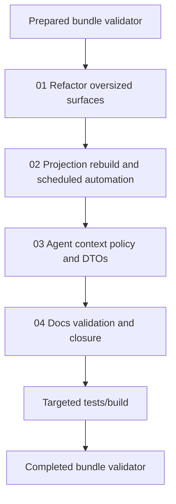

# Phase Plan

## Execution Order

1. Refactor oversized surfaces.
2. Add projection rebuild and scheduled automation execution.
3. Separate agent-facing context and make process-critical policy explicit.
4. Update docs and run final validation.

## Subbundle Dependency Map

## Critical Subbundles

- `01-refactor-oversized-surfaces` is a maintainability foundation; behavioral work should not expand oversized files.
- `02-projection-rebuild-and-scheduled-automation` is the main operational hardening gate.
- `03-agent-context-policy-and-dtos` is the process-critical correctness gate.
- `04-docs-validation-and-closure` is the final truth gate.

## Phase Gates

- Gate before implementation: prepared-stage validator must pass.
- Gate after subbundle 01: project builds enough to prove splits compile.
- Gate after subbundle 02: projection rebuild and automation tests pass.
- Gate after subbundle 03: agent context policy tests pass.
- Gate after subbundle 04: docs and roadmap match source; targeted tests/build, `git diff --check`, and completed-stage validator pass.
