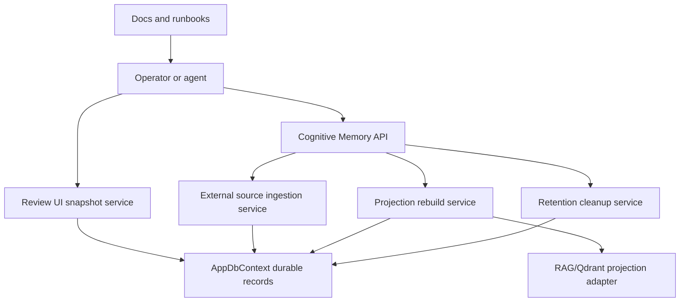

# Target Solution

## Boundary Decisions

- API versioning is additive. The legacy `/api/cognitive-memory` route remains available, and the v1 contract is explicit in docs and machine-readable contract metadata.
- Provider failure hardening records failure details through existing projection/run status concepts and does not invent a second projection authority.
- Retention cleanup is an explicit application service under `Operations`, registered through the Cognitive Memory module and exposed through API/UI only as an operator command.
- Audit view data flows through `ICognitiveMemoryReviewUiService`; Blazor components render DTOs and do not query EF directly.
- External source policy belongs in the ingestion service contracts and validation helpers, not only the web API upload endpoint.

## Runtime Flow

## Data Safety Invariant

- P1 cleanup may remove operational traces, expired jobs, resolved review items, stale candidates, and transient probe data only when requested through a typed cutoff policy. Canonical memory records, source manifests, source items, evidence anchors, claims, and projection state are not deleted by default.
