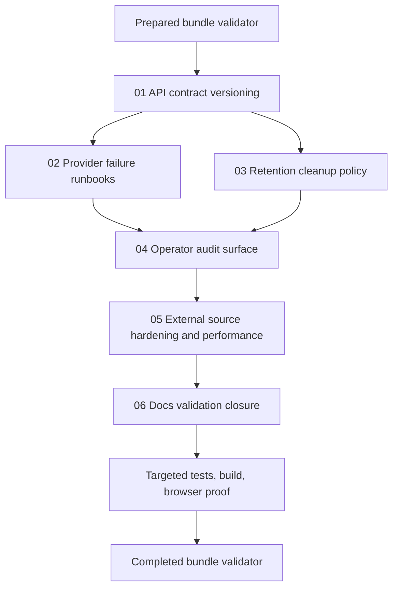

# Phase Plan

## Execution Order

1. Stabilize the v1 API contract and examples.
2. Add provider/projection failure proof and runbooks.
3. Add explicit retention cleanup service/API.
4. Add operator audit snapshot/UI surface.
5. Harden external source ingestion and performance docs.
6. Update docs and run final validation.

## Subbundle Dependency Map

## Critical Subbundles

- `01-api-contract-versioning` protects existing callers while making v1 explicit.
- `03-retention-cleanup-policy` is the data-safety gate; it must not delete canonical memory by default.
- `04-operator-audit-surface` is the browser-proof gate because it affects rendered Blazor UI.
- `06-docs-validation-closure` is the truth gate and must not claim beta if the release gate is not met.

## Phase Gates

- Gate before implementation: prepared-stage bundle validator must pass.
- Gate after subbundle 01: legacy and v1 contract surfaces are both documented and build.
- Gate after subbundle 02: provider failure behavior has deterministic proof and a live-provider runbook.
- Gate after subbundle 03: cleanup dry-run and execute behavior are covered by tests.
- Gate after subbundle 04: operator audit data is visible in service/UI proof.
- Gate after subbundle 05: source-ingestion limits/policy and performance docs are updated and tested where possible.
- Gate after subbundle 06: docs/roadmap match source; targeted tests/build, `git diff --check`, browser proof, and completed-stage validator pass.
