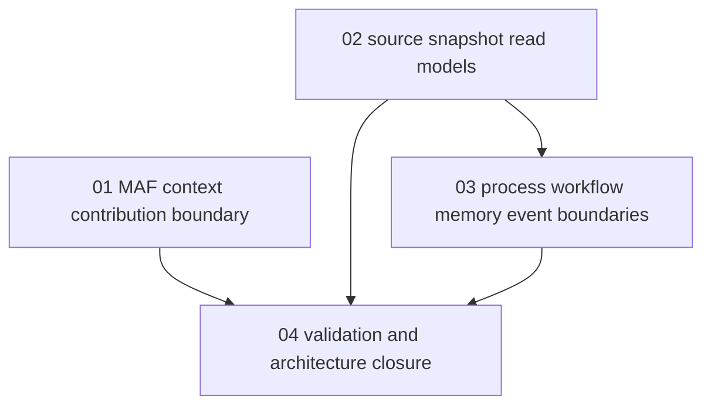

# Phase Plan

## Execution Order

1. `01-maf-context-contribution-boundary`
2. `02-source-snapshot-read-models`
3. `03-process-workflow-memory-event-boundaries`
4. `04-validation-and-architecture-closure`

## Subbundle Dependency Map

## Critical Subbundles

- `01-maf-context-contribution-boundary` protects the future MAF integration from private hardwiring.
- `02-source-snapshot-read-models` protects source ingestion from ad hoc table reads.
- `03-process-workflow-memory-event-boundaries` protects episodic/procedural memory from direct persistence coupling.

## Phase Gates

- Preparation gate: prepared-stage validation must pass before implementation starts.
- MAF gate: contributor ordering, skip/failure results, and compatibility behavior must be proven.
- Source gate: snapshot providers must expose stable ids, hashes, cursors, provenance, and layout/reference metadata.
- Process/workflow gate: runtime evidence must be exposed without changing existing process/workflow behavior.
- Closure gate: Cognitive Memory architecture must be updated to consume these boundaries.
