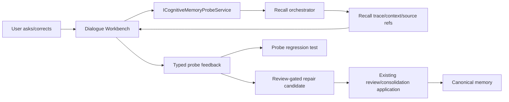

# Target Solution

## Boundary

The Dialogue Workbench is an operator/user surface over Cognitive Memory probing. It is not an alternate chat runtime and not an alternate memory mutation engine.

## Data Flow

## Repair Strategy

Use existing review application semantics where possible:

- probe feedback persists `CognitiveMemoryProbeFeedbackRecord`;
- correction/incorrect/wrong-scope feedback creates a pending `CognitiveMemoryReviewItemRecord`;
- correction text becomes a concrete consolidation candidate payload linked to the review item;
- approving the review item applies that candidate through the existing `ICognitiveMemoryConsolidationCandidateApplicator`;
- feedback remains evidence and audit trail; the active memory change happens only through the review path.

## UI Strategy

Add a Dialogue Workbench panel to the existing Cognitive Memory page:

- project id is taken from `?projectId=...`;
- session title, recall mode, question input, and action buttons are visible;
- answer output renders returned context sections rather than only a summary line;
- side panel renders source refs and recall stages;
- feedback controls use explicit buttons and text areas for notes/corrections.

## Intentional Follow-Up

Epistemic Drive-generated random question queues are not required for this first repair. Free user dialogue is the critical foundation because it exercises the same feedback and repair path that generated questions will later use.
