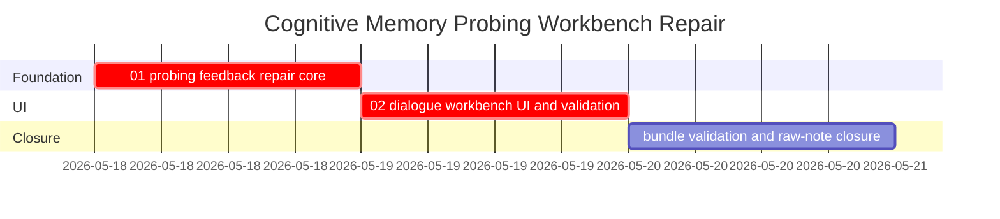

# Phase Plan

## Phase Sequence

1. Prepare and validate this bundle.
2. Execute `01-01-probing-feedback-repair-core` as the critical foundation.
3. Execute `02-02-dialogue-workbench-ui-and-validation` after the repair path is proven.
4. Run realistic-project API and browser validation.
5. Run final closure audit and validators.

## Subbundle Dependency Map

- `02` depends on `01` because the UI must not expose correction/approval controls that cannot actually repair memory.

## Critical Subbundles

- `01-01-probing-feedback-repair-core` is a critical foundation. Downstream UI proof is misleading unless approved probe corrections can create/update memory through the review path.
- `02-02-dialogue-workbench-ui-and-validation` is a critical UI foundation. It must prove the real user workflow, not just the API.

## Phase Gates

- Gate after preparation: run the bundle validator and repair failures.
- Gate before `01`: confirm existing probe and review services compile and the realistic project ids are known.
- Gate after `01`: targeted tests prove correction feedback creates a review-linked candidate and approval applies it.
- Gate before `02`: `01` closure proof passed.
- Gate after `02`: browser proof shows start session, ask, answer evidence, feedback, and review/repair visibility on `/cognitive-memory?projectId=...`.
- Gate before closure: rerun validators, close raw notes, and reopen anything with weak proof.
