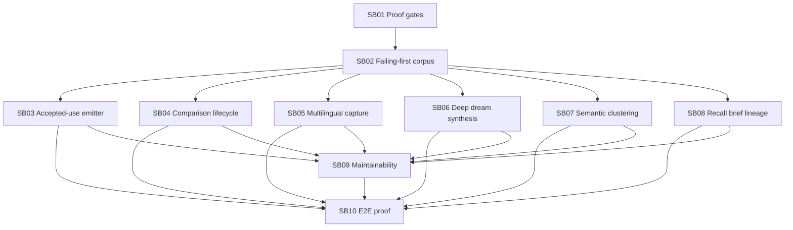

# Phase Plan

## Execution Order

1. Execute SB01 and install the stronger workflow/validator gates.
2. Execute SB02 and prove the current implementation fails the new behavioral regressions.
3. Execute SB03-SB08 in dependency order.
4. Execute SB09 maintainability refactors after behavior is protected by tests.
5. Execute SB10 final red-team proof and completed-stage validation.

## Subbundle Dependency Map

## Critical Subbundles

- SB01 is critical because without stronger proof gates Codex can repeat the current consumer-only implementation failure.
- SB02 is critical because production changes must be guarded by failing-first tests.
- SB03 is critical because professor assimilation currently lacks production accepted-use evidence emission.
- SB06 is critical because current dream synthesis still stores meta-evidence text instead of internalized knowledge.
- SB08 is critical because recall output must be useful and referenceable without overwhelming the requester.
- SB10 is critical because the full lifecycle must be proven end to end.

## Phase Gates

- Gate A: SB01 completed and validator fake-proof fixtures fail/pass as intended.
- Gate B: SB02 tests fail on current implementation before production fixes.
- Gate C: SB03-SB08 pass targeted production behavior tests without manual test seeding of production-only signals.
- Gate D: SB09 refactors compile and do not weaken behavior tests.
- Gate E: SB10 end-to-end proof, raw-note closure, artifact-backed proof manifests, and completed-stage validation all pass.
