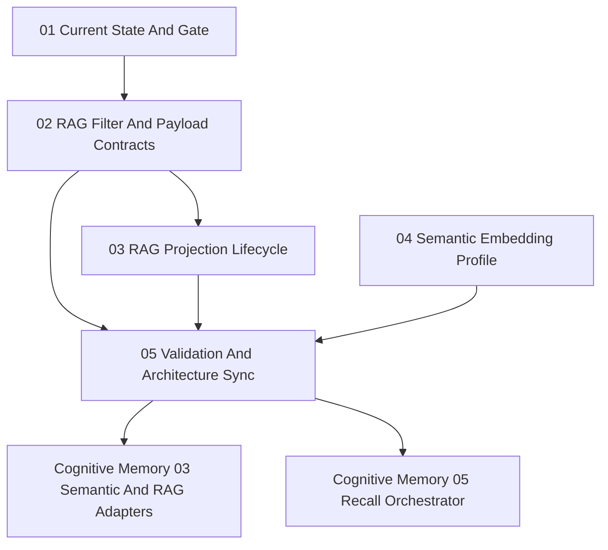

# Phase Plan

## Phase Sequence

1. Confirm current hardening proof and projection-side gap in `01-00-current-state-and-gate`.
2. Add typed RAG filter and payload index contracts in `02-01-rag-filter-and-payload-contracts`.
3. Add projection lifecycle cleanup operations in `03-02-rag-projection-lifecycle`.
4. Add SemanticCompletion embedding profile metadata in `04-03-semantic-embedding-profile`.
5. Run cross-repo validation and sync Cognitive Memory architecture gates in `05-04-validation-and-architecture-sync`.

## Subbundle Dependency Map

## Critical Subbundles

- `02-01-rag-filter-and-payload-contracts`: critical foundation for safe scoped recall and provider-neutral projection adapters.
- `03-02-rag-projection-lifecycle`: critical foundation for rebuild and stale projection cleanup.
- `04-03-semantic-embedding-profile`: critical foundation for projection hashes, embedding profile tracking, and rebuild decisions.

## Phase Gates

- Preparation gate: validate this bundle at prepared stage before implementation starts.
- Gate after `01-00-current-state-and-gate`: implementation agent must confirm the source boundary hardening is already closed and must not reopen it without a concrete blocker.
- Gate after `02-01-rag-filter-and-payload-contracts`: RAG tests must prove filter validation and provider translation or explicit unsupported behavior.
- Gate after `03-02-rag-projection-lifecycle`: tests must prove stale projection cleanup can be expressed without enumerating all ids.
- Gate after `04-03-semantic-embedding-profile`: tests must prove deterministic profile metadata for at least local hashing and ONNX-capable paths or documented ONNX environment skip behavior.
- Closure gate: both related repos pass targeted tests, architecture docs are synced, execution report contains raw-note closure, and bundle validation passes at completed stage.

## Reopen Rules

- Reopen RAG filter work if any Cognitive Memory prompt or architecture update asks for post-filtered global vector results.
- Reopen lifecycle work if cleanup still requires direct Qdrant calls from Cognitive Memory.
- Reopen SemanticCompletion profile work if projection records cannot persist stable embedding profile identity.
