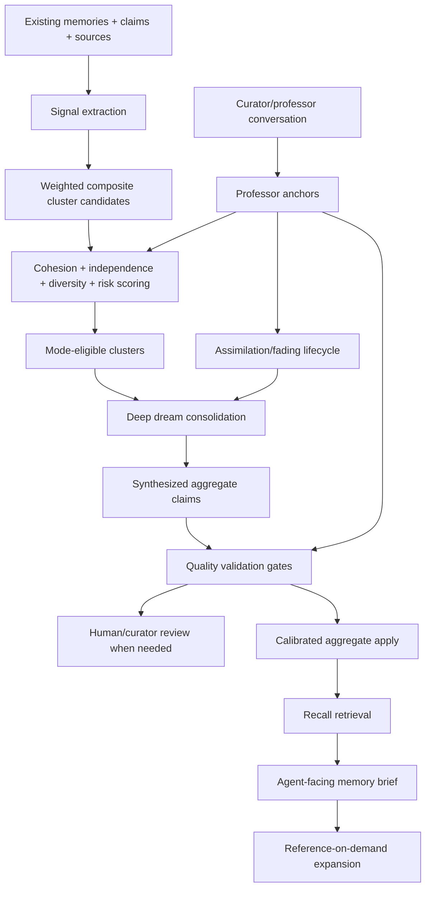

# Target Solution Architecture

## Target Pipeline

## Weighted Multi-Key Clustering

Replace “one key equals one cluster” with a candidate model where keys are signals. A cluster candidate should include:

- Strong semantic signals: topic, entity, relation graph, shared claims, evidence overlap.
- Supporting context signals: source topology, temporal proximity, project scope, access/risk, task intent.
- Negative/guard signals: contradiction, restricted content, stale/superseded state, excessive size, low source diversity.

A cluster should become aggregate-eligible only when the weighted combination crosses a configured threshold and passes guardrails. Broad keys such as project scope, month, access/risk, or source item type are useful features but must not promote a cluster alone.

## Deep Dream Consolidation

Dreaming should operate on eligible clusters and produce a structured aggregate:

- `AggregateSummary`: concise human/agent-friendly meaning.
- `AggregateClaims`: synthesized claims, not copied source-memory claims unless explicitly marked as carry-through.
- `SupportMap`: claim-level source memories, source items, evidence anchors, direction, and support strength.
- `ConflictMap`: contradictory or scope-limited memories.
- `UncertaintyNotes`: what remains unresolved.
- `AssimilationActions`: which professor anchors, stale memories, or aggregates must be rechecked.

## Dream Validation

Validation must prove both provenance and semantic quality:

- Every claim has source maps.
- Every source map is readable under policy and not stale/rejected unless explicitly framed as conflict history.
- The cluster is cohesive and not only low-signal broad grouping.
- The evidence is independent enough: not just repeated references to the same source item/manifest/generated aggregate.
- The aggregate does not duplicate an existing aggregate unless it updates/supersedes it with clear lineage.
- Professor anchors that contradict the candidate force review or targeted repair.

## Curator/Professor Learning

Curator should model the user as a professor/source-of-truth, but not as a blunt overwrite mechanism.

The target model:

1. A conversation turn may produce one or more structured professor assertions.
2. Each assertion has scope, target memory/claim ids where available, target confidence, language/capture source, and evidence anchor.
3. The assertion becomes a high-trust professor anchor.
4. Dreaming and clustering repeatedly compare anchors with existing memory.
5. Once stable derived memories and aggregates incorporate the lesson, the professor anchor can transition to assimilated and later faded/retired.
6. The system preserves enough lineage to answer “which professor statement taught this?” while not overloading normal recall briefs.

## Recall Synthesis

Recall must not simply dump selected context. It should generate a brief:

- Focused on the requester's task and intent.
- Free of internal scores/references by default.
- Explicit about uncertainty or conflicts only when useful.
- Capable of reference-on-demand expansion to statement-level, claim-level, and original-source provenance.
