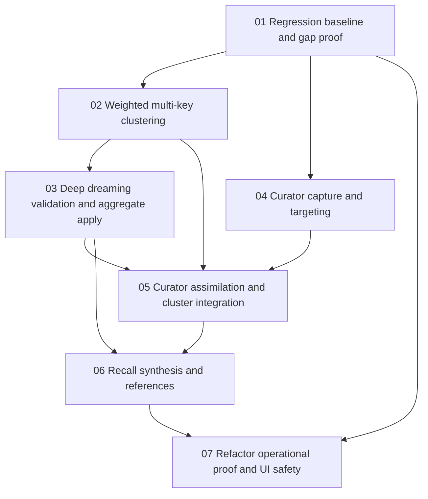

# Phase Plan

## Execution Order

| Phase | Subbundle | Purpose | Gate |
|---:|---|---|---|
| 1 | 01-regression-baseline-and-gap-proof | Create failing tests and baseline reports for current gaps. | Regression tests must fail before implementation and pass after. |
| 2 | 02-weighted-multikey-clustering-and-eligibility | Fix cluster formation/promotion. | No low-signal-only cluster may become aggregate-ready. |
| 3 | 03-deep-dreaming-validation-and-aggregate-apply | Deepen dream generation, validation, and aggregate application. | Mixed/broad/weak candidates fail or need review; good candidates apply with calibrated confidence. |
| 4 | 04-curator-professor-anchor-capture-and-targeting | Make curator capture structured and target-safe. | Ambiguous corrections do not broad-supersede memories. |
| 5 | 05-curator-assimilation-cluster-integration-and-forgetting | Integrate professor anchors into clustering/dreaming and lifecycle. | Professor anchors influence consolidation and can fade only after assimilation proof. |
| 6 | 06-agent-facing-recall-synthesis-and-references | Produce useful recall briefs with references on demand. | Agent-facing brief is concise, no default internals, references expand correctly. |
| 7 | 07-refactor-operational-proof-and-ui-safety | Refactor, wire UI/API proof, and close full validation. | Clean build/test/component/browser proof and execution report closure. |

## Subbundle Dependency Map

## Critical Subbundles

- `01-regression-baseline-and-gap-proof` is critical because later agents need objective failures to avoid re-implementing only plumbing.
- `02-weighted-multikey-clustering-and-eligibility` is critical because every dream and aggregate depends on cluster quality.
- `04-curator-professor-anchor-capture-and-targeting` is critical because unsafe broad correction can damage the memory graph.
- `05-curator-assimilation-cluster-integration-and-forgetting` is critical because it determines whether professor mode is a true learning mode or only a direct mutation shortcut.

## Phase Gates

- Do not begin SB03 until SB02 proves that broad low-signal clusters are either ineligible or require review.
- Do not begin SB05 until SB04 proves corrections can target specific memories/claims and ambiguous targets stay pending/reviewed.
- Do not begin SB06 integration until SB03 and SB05 expose enough provenance to support reference expansion.
- Do not close SB07 until all subbundle proof artifacts are recorded in `reviews/01-execution-report.md`, including browser validation rows for UI-visible changes.
