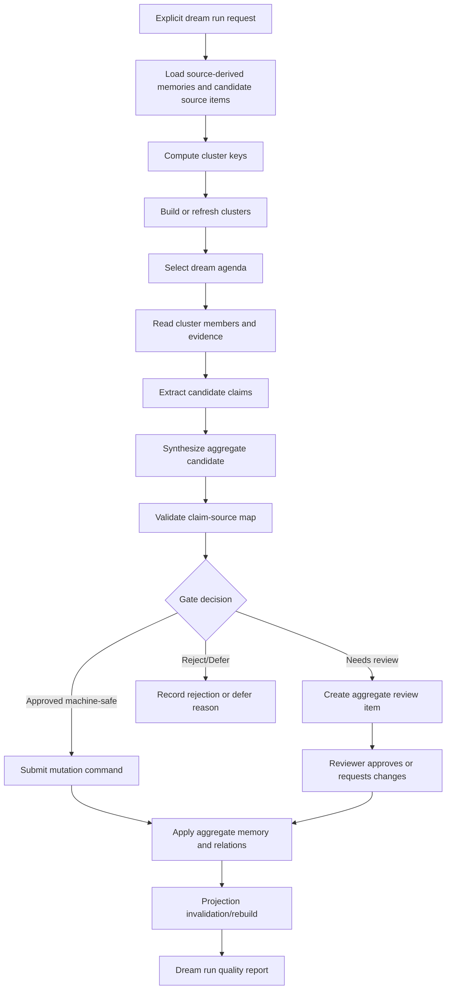
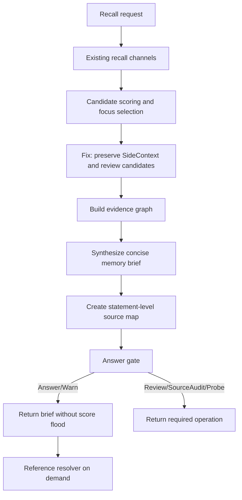

# Target Solution Architecture

## Target Shape

The target design separates four responsibilities that are currently partially blended together:

1. **Ingestion and incremental consolidation**: converts source items into basic source-derived memories when appropriate.
2. **Clustering and dreaming**: periodically or explicitly groups memories/source items, detects patterns, and creates aggregate candidates.
3. **Validation and review**: verifies aggregate candidates before activation.
4. **Retrieval synthesis and reference resolution**: turns selected memories into a concise brief and exposes provenance on demand.

## Proposed Component Interfaces

```csharp
public interface ICognitiveMemoryClusterPlanner
{
    ValueTask<CognitiveMemoryClusterPlanResult> PlanAsync(CognitiveMemoryClusterPlanRequest request, CancellationToken cancellationToken = default);
}

public interface ICognitiveMemoryDreamRunner
{
    ValueTask<CognitiveMemoryDreamRunResult> RunAsync(CognitiveMemoryDreamRunRequest request, CancellationToken cancellationToken = default);
}

public interface ICognitiveMemoryAggregateSynthesizer
{
    ValueTask<CognitiveMemoryAggregateSynthesisResult> SynthesizeAsync(CognitiveMemoryAggregateSynthesisRequest request, CancellationToken cancellationToken = default);
}

public interface ICognitiveMemoryDreamValidator
{
    ValueTask<CognitiveMemoryDreamValidationResult> ValidateAsync(CognitiveMemoryDreamValidationRequest request, CancellationToken cancellationToken = default);
}

public interface ICognitiveMemoryRecallSynthesisService
{
    ValueTask<CognitiveMemorySynthesizedRecallResult> SynthesizeAsync(CognitiveMemoryRecallSynthesisRequest request, CancellationToken cancellationToken = default);
}

public interface ICognitiveMemoryReferenceResolver
{
    ValueTask<CognitiveMemoryReferenceResolutionResult> ResolveAsync(CognitiveMemoryReferenceResolutionRequest request, CancellationToken cancellationToken = default);
}
```

Comments in C# code must remain in English.

## Multi-Key Cluster Families

| Key family | Examples | Purpose |
|---|---|---|
| Project/workspace scope | ProjectId, workspace frame, stageId, source scope key | Prevent cross-project contamination and preserve current project focus behavior. |
| Source topology | source system, source item type, source manifest, project-structure parent/child | Group facts from the same document/mindmap/process hierarchy. |
| Semantic topic | normalized title/topic, embedding centroid, taxonomy domain | Merge memories about the same concept even across documents. |
| Entity | extracted actors, products, modules, APIs, customers, risks | Let dreaming aggregate around real entities rather than only text. |
| Task/intent | deployment, architecture, finance, UX, validation, sales, operations | Produce task-specific summaries and memory briefs. |
| Temporal | observed date, effective date, superseded date, recency/staleness bucket | Handle updates and supersession. |
| Evidence overlap | shared evidence anchors, matching claims, source hash similarity | Detect duplicates and strengthen support. |
| Relation/contradiction | supports, contradicts, supersedes, refines, depends-on | Build validated aggregate structure. |
| Access/risk | access level, redaction state, risk level | Prevent unsafe aggregation and unsafe reference expansion. |

## Proposed Persistence Additions

Codex should choose final names consistent with existing conventions, but the architecture expects durable equivalents of:

- `CognitiveMemoryClusterRecord`
- `CognitiveMemoryClusterKeyRecord`
- `CognitiveMemoryClusterMemberRecord`
- `CognitiveMemoryDreamRunRecord`
- `CognitiveMemoryDreamRunClusterRecord`
- `CognitiveMemoryAggregateCandidateRecord`
- `CognitiveMemoryAggregateClaimRecord`
- `CognitiveMemoryAggregateClaimSourceMapRecord`
- `CognitiveMemorySynthesizedRecallRecord`
- `CognitiveMemorySynthesizedStatementRecord`
- `CognitiveMemorySynthesizedStatementSourceMapRecord`

Where possible, reuse existing `CognitiveMemoryRelationRecord`, `CognitiveMemoryClaimRecord`, source links, evidence links, mutation commands, and review items instead of duplicating concepts.

## Dreaming Flow



## Retrieval Synthesis Flow



## Validation Metrics

Every dream run should persist at least these metrics:

- Source items considered.
- Memory records considered.
- Cluster keys computed.
- Clusters created/refreshed.
- Cluster members read.
- Claims extracted.
- Aggregate candidates created.
- Aggregate claims generated.
- Claim-source maps generated.
- Validation checks executed.
- Approved/rejected/review/deferred counts.
- Elapsed time by stage.
- Minimum/average/maximum evidence coverage per aggregate.
- Contradiction and staleness pressure distribution.
- Redaction/access exclusions.

## Out Of Scope For This Bundle

- Economic memory control.
- Attention pricing.
- Autonomous always-on background worker without explicit run audit.
- Replacing all current source ingestion and recall tests.
