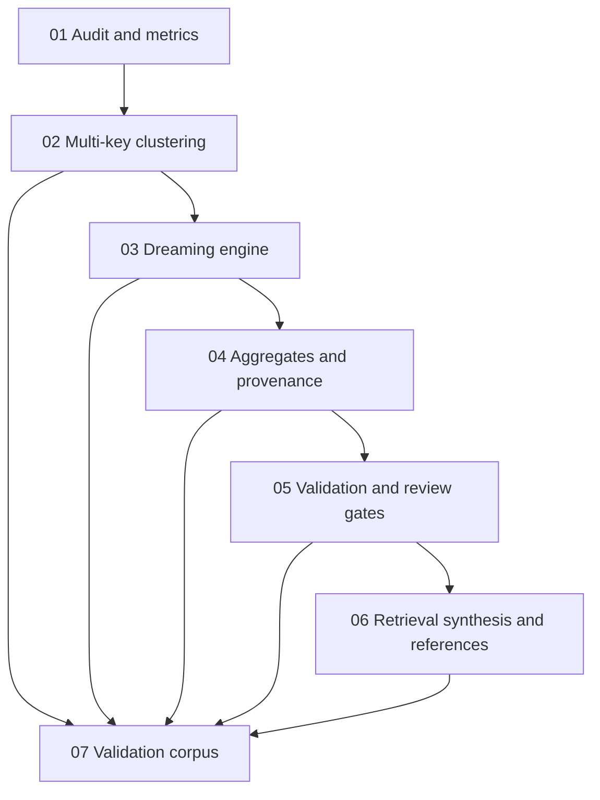

# Phase Plan

## Execution Order

1. Run Subbundle 01 to create the baseline audit, failing tests, and quality metrics.
2. Run Subbundle 02 to add durable multi-key clustering substrate.
3. Run Subbundle 03 to implement explicit dream runs over clusters.
4. Run Subbundle 04 to persist aggregate memories with claim-level provenance.
5. Run Subbundle 05 to add validation and review gates.
6. Run Subbundle 06 to implement recall synthesis and reference-on-demand behavior.
7. Run Subbundle 07 to prove the entire loop with a regression corpus and UI/API evidence.

## Subbundle Dependency Map

## Critical Subbundles

- Subbundle 01 is critical because it prevents Codex from implementing changes without proving the current gaps first.
- Subbundle 02 is critical because all dreaming quality depends on durable cluster membership and key families.
- Subbundle 04 is critical because synthesized aggregate knowledge without claim-level provenance is unsafe.
- Subbundle 06 is critical because the user explicitly needs useful formulated memory output, not raw thought dumps.
- Subbundle 07 is critical because the existing validation bundles do not prove the new behaviors.

## Phase Gates

| Gate | Required proof |
|---|---|
| Gate A - Baseline | Audit report identifies current source-level gaps and adds failing tests or pending test cases for dream/clustering/synthesis. |
| Gate B - Clustering | Tests prove multiple key families, duplicate clustering, project isolation, and cluster membership persistence. |
| Gate C - Dreaming | Tests prove explicit dream runs create aggregate candidates from clusters and persist depth metrics. |
| Gate D - Provenance | Tests prove every aggregate claim maps back to source memories/items/evidence anchors. |
| Gate E - Validation | Tests prove weak/contradictory/restricted aggregates are rejected or reviewed, not silently activated. |
| Gate F - Synthesis | Tests prove concise synthesized briefs and on-demand reference expansion. |
| Gate G - End-to-end | Integration and optional Playwright proof demonstrate the complete loop on a representative corpus. |
