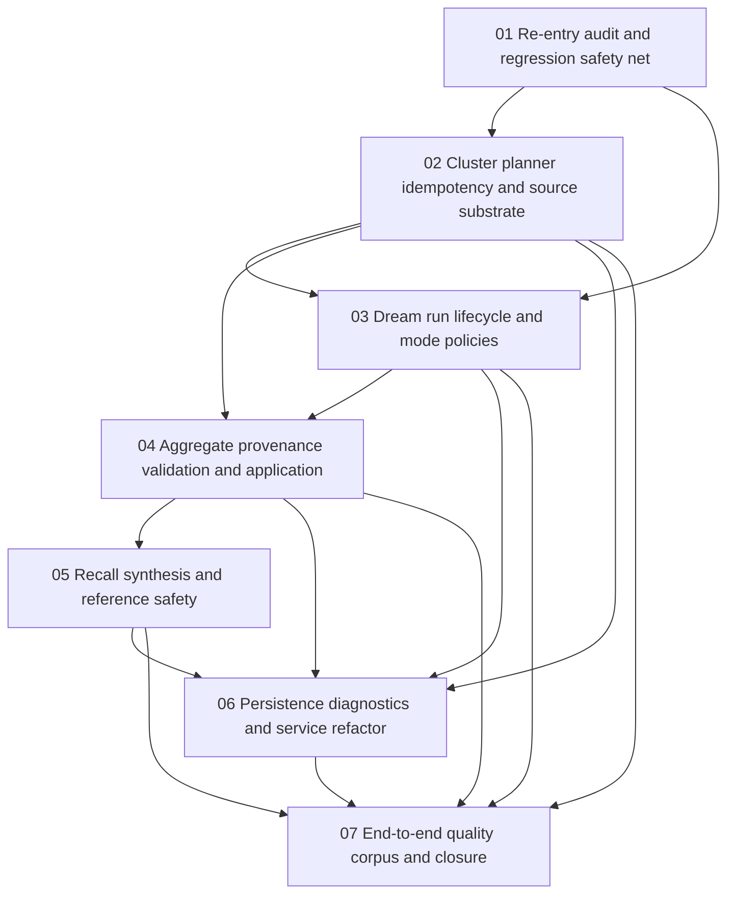

# Phase Plan

## Execution Order

1. Subbundle 01 captures the re-entry audit and failing regression tests.
2. Subbundle 02 fixes cluster planner idempotency and source/member substrate.
3. Subbundle 03 hardens dream-run lifecycle, transactions, dry-run behavior, and explicit mode policies.
4. Subbundle 04 hardens aggregate synthesis, validation, application, and provenance.
5. Subbundle 05 hardens recall synthesis and reference-on-demand safety.
6. Subbundle 06 performs persistence, diagnostics, logging, and service refactor cleanup.
7. Subbundle 07 proves the full loop with end-to-end corpus tests and bundle closure.

## Subbundle Dependency Map

## Critical Subbundles

- Subbundle 01 is a critical foundation because later refactors must be measured against failing-before/fixed-after tests, not intuition.
- Subbundle 02 is a critical foundation because dream runs and aggregate candidates depend on stable cluster IDs and memberships.
- Subbundle 03 is a critical foundation because every downstream proof is untrustworthy if dream runs can leave partial or misreported state.
- Subbundle 04 is a critical foundation because aggregate memories without strong provenance and validation can corrupt recall.
- Subbundle 05 is a critical foundation because synthesis is the consumer-facing behavior the original request cared about.
- Subbundle 07 is the final closure gate because only corpus-level proof can validate the entire memory quality loop.

## Phase Gates

| Gate | Required proof |
|---|---|
| Gate A - Re-entry | New regression tests or explicit pending tests capture repeat planning, repeat dream run, dry run, failure path, mode policy, redaction, aggregate application, and recall synthesis gaps. |
| Gate B - Cluster | Repeated cluster planning and second dream run use persisted cluster IDs and keep FK integrity; source-item member decision is implemented or explicitly narrowed. |
| Gate C - Dream lifecycle | Dream runs have transaction/failure semantics, dry-run behavior, idempotent replay, and no broad default mode behavior. |
| Gate D - Aggregate | Aggregate candidates are grounded, policy-safe, validated, and applied idempotently with claim-level provenance. |
| Gate E - Synthesis | Synthesized briefs merge selected memory into concise grounded statements with hidden-but-resolvable references and policy-safe expansion. |
| Gate F - Persistence/refactor | Service split compiles, DI works, migrations build, diagnostics/logging include actionable state, and no public contract drift is accidental. |
| Gate G - Closure | Full CognitiveMemory test filters plus targeted builds pass; prior bundle closure is updated or qualified; execution report rows are complete. |
