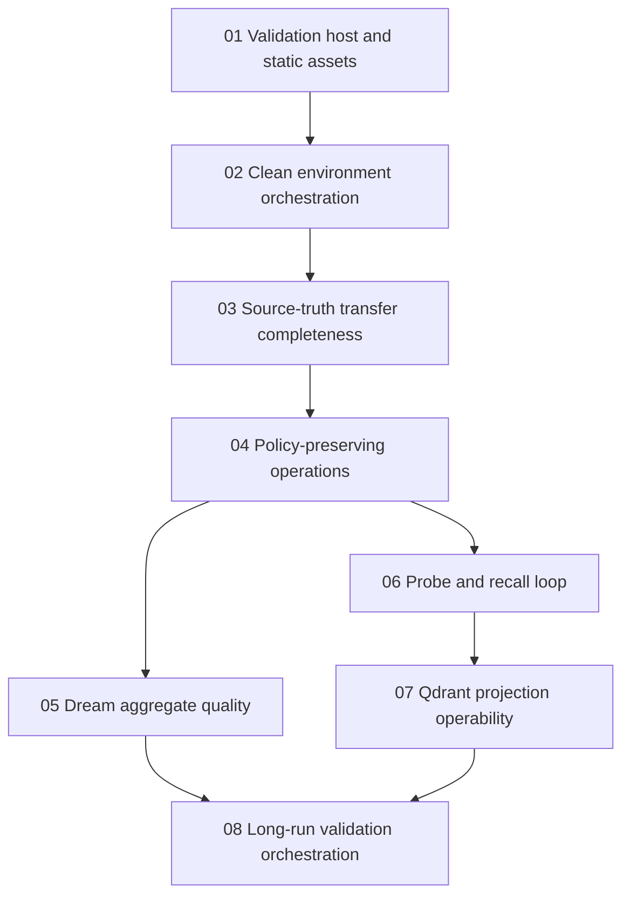

# Phase Plan

## Execution Order

1. `subbundles/01-validation-host-and-static-assets`
2. `subbundles/02-clean-environment-orchestration`
3. `subbundles/03-source-truth-transfer-completeness`
4. `subbundles/04-policy-preserving-operations`
5. `subbundles/05-dream-aggregate-quality`
6. `subbundles/06-probe-and-recall-loop`
7. `subbundles/07-qdrant-projection-operability`
8. `subbundles/08-long-run-validation-orchestration`

## Subbundle Dependency Map

## Critical Subbundles

- `02-clean-environment-orchestration` is critical because every realistic validation result depends on knowing the active database profile and projection provider.
- `03-source-truth-transfer-completeness` is critical because source-truth loss invalidates later clustering, dreaming, recall, and probe conclusions.
- `04-policy-preserving-operations` is critical because restricted validation must preserve explicit operator access policy end to end.
- `07-qdrant-projection-operability` is critical because vector recall must fail visibly when projection options or provider readiness are missing.

## Phase Gates

- Phase 1 can close only after startup/static asset behavior is either proven or reported as a precise configuration error.
- Phase 2 can close only after API status exposes active database profile and projection readiness.
- Phase 3 can close only after transfer preview and execution preserve source locators, hashes, redaction state, and skipped-item reasons.
- Phases 4 through 7 can close only after focused tests prove policy and projection options do not get dropped across probe, recall, dreaming, and consolidation paths.
- Phase 8 can close only after repeated cycles produce operation IDs, resumable cursors, metrics, approval checkpoints, and trouble records.

## Phase 1: Validation Host And Static Assets

- Reproduce the no-build/static asset failure.
- Define the supported local startup modes for validation runs.
- Add startup diagnostics for missing static web assets.
- Validate Development and production-like startup paths explicitly.

## Phase 2: Clean Environment Orchestration

- Add API/UI status fields for active profile source, override reason, database name, and projection provider readiness.
- Add an idempotent clean validation profile creation flow with clear operator confirmation.
- Add Qdrant collection readiness checks and collection metadata inspection.

## Phase 3: Source Truth Transfer Completeness

- Extend transfer preview and execution to include external file/data manifests.
- Add content-hash proof, redaction-state proof, and skipped-secret proof.
- Preserve project/project-structure identity and source locators.

## Phase 4: Policy-Preserving Operations

- Store full policy context on probe sessions.
- Use the stored policy when asking probe turns.
- Carry policy context into quality planning, dreaming, recall, and review audit rows.
- Add tests that restricted validation sessions can recall restricted source truth when explicitly allowed.

## Phase 5: Dream Aggregate Quality

- Improve aggregate title/body generation from primary cluster keys and source snippets.
- Add quality gates that flag structural-only aggregates before human approval.
- Add dream aggregate review-decision audit and application semantics.

## Phase 6: Probe And Recall Loop

- Pass projection collection/profile/embedding options through probe ask requests.
- Add regression tests for probe feedback that creates repair candidates.
- Add UI/API proof that a probe correction can be reviewed and consolidated.

## Phase 7: Qdrant Projection Operability

- Add default projection profile diagnostics.
- Add projection rebuild status summaries per project and collection.
- Add recall traces that distinguish configured vector search, skipped vector search, and provider failure.

## Phase 8: Long-Run Validation Orchestration

- Add validation cycle IDs, resumable cursors, and per-cycle metrics.
- Run repeated consolidation/dreaming/probe/recall cycles under controlled approval gates.
- Produce an XLSX ledger with counts, operation IDs, accepted/rejected memories, recall traces, and unresolved findings.
