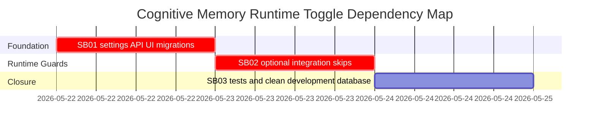

# Phase Plan

## Phase Sequence

1. SB01 adds the persisted settings/API/UI contract and migrations.
2. SB02 gates optional integrations that can run Cognitive Memory from outside the management page.
3. SB03 runs targeted validation, records proof, and resets/migrates the development PostgreSQL database.

## Subbundle Dependency Map

## Critical Subbundles

- `SB01` is a critical foundation because every runtime guard depends on the new persisted setting and its default behavior.
- `SB02` is a critical foundation because the reported exception is caused by an optional integration point, and downstream demos are untrustworthy until disabled mode prevents those calls.

## Phase Gates

- Gate after preparation: run `python codex/skills/bundles/candoitall-bundle-preparation/scripts/validate_bundle.py --stage prepared codex/bundles/cognitive-memory-runtime-toggle`.
- SB01 entry gate: confirm no existing bundle already owns this runtime toggle and confirm current settings schema.
- SB01 closure gate: settings contract compiles, migrations exist for both providers, and round-trip tests are updated.
- SB02 entry gate: SB01 setting is available through service/API/UI.
- SB02 closure gate: disabled agent context, workflow executor, and scheduled automation tests prove no downstream memory call.
- SB03 closure gate: targeted tests/build proof are recorded and `candoitall_development` is clean/migrated.
- Final closure gate: raw notes `N001`-`N007` are marked solved or explicitly partial with proof paths.
