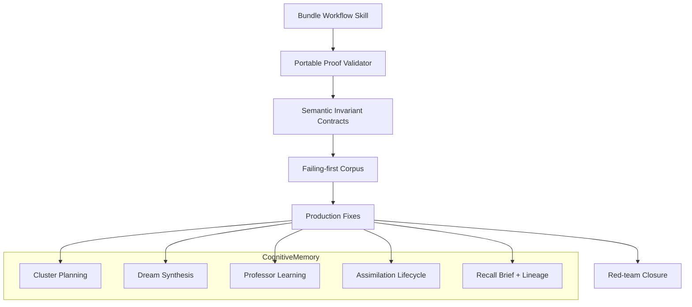

# Target Solution

## Layered target architecture

## Cognitive-memory target behavior

- Clustering should use exact keys, approximate semantic neighbors, policy-aware project scope, and coverage-aware primary keys.
- Dreaming should form claim groups by semantic claim slots, not only by cluster primary key.
- Dream validation should test support, contradiction, scope, numbers, time, actor/action, and conditions.
- Professor mode should capture what the human source-of-truth teaches in natural conversation and keep it as a temporary anchor until the memory demonstrates mastery.
- Assimilation should be event-backed: repeated correct use, independent non-descendant support, aggregate-ready integration, and auditable transitions.
- Recall should produce concise task-facing briefs and keep exact statement-to-claim-to-source lineage available on demand.

## Proof target behavior

- Completion proof must be portable and reproducible.
- Critical subbundles must publish a semantic invariant contract.
- Failing-first and passing transcripts must cite the same invariant IDs.
- Changed production files must be hashed and mapped to invariant IDs.
- A red-team report must try to break each claimed fix with adversarial inputs.
