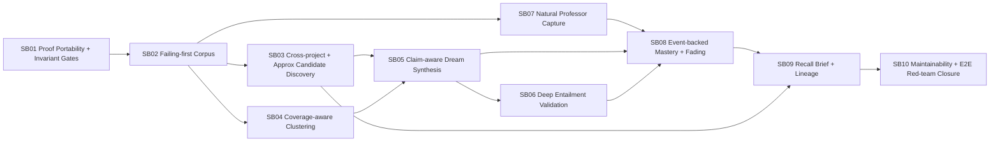

# Phase Plan

## Execution Order

| Phase | Subbundle | Purpose |
|---|---|---|
| 1 | SB01 | Fix proof portability and semantic invariant gates before production work continues. |
| 2 | SB02 | Add failing-first adversarial tests for all remaining gaps. |
| 3 | SB03-SB08 | Implement cognitive-memory behavior fixes. |
| 4 | SB09 | Refactor maintainability and configuration. |
| 5 | SB10 | Run end-to-end red-team closure and completed-stage proof. |

## Subbundle Dependency Map

## Critical Subbundles

- SB01 is critical because it prevents another shallow or non-portable completion.
- SB02 is critical because production changes must be driven by failing-first semantic tests.
- SB03 is critical because `CrossProjectWeekly` is currently semantically misleading.
- SB05 is critical because dream claim grouping can merge unrelated claims.
- SB07 and SB08 are critical because professor learning must not retire human source truth based on keyword evidence.
- SB09 is critical because recall must be useful without flooding consumers while preserving exact lineage on request.
- SB10 is critical because final closure must prove the whole loop, not only isolated helpers.

## Phase Gates

- Codex must install and use the updated skills from SB01 before starting SB02.
- No production cognitive-memory code may change before SB02 failing-first tests are committed and documented.
- No subbundle may close without a `semantic-invariants` artifact and a proof manifest.
- No feature subbundle may cite only existing broad tests; it must cite at least one targeted failing-first and one targeted passing transcript.
- Final closure must run completed-stage bundle validation, targeted unit tests, broad cognitive-memory tests, fake-proof fixtures, anti-stub audit, scope guard, and red-team review.
