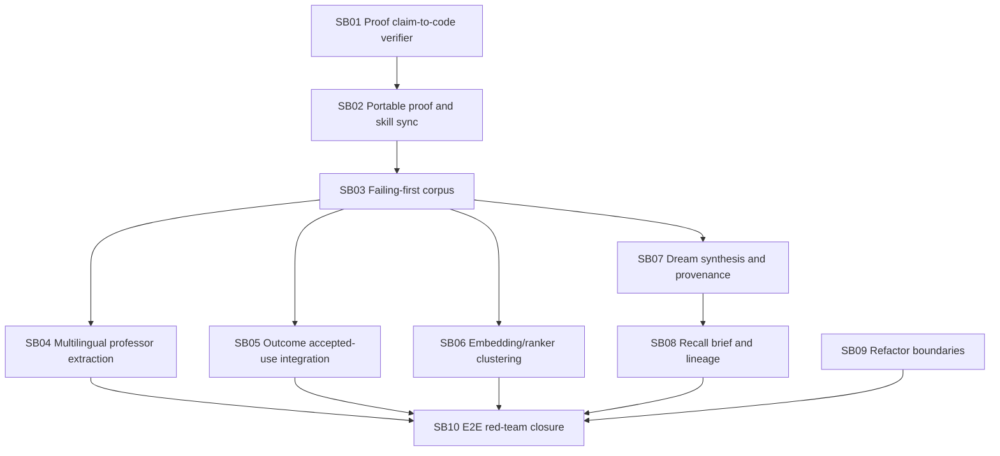

# Phase Plan

## Execution Order

1. SB01 hardens claim-to-code proof gates.
2. SB02 closes proof portability and active skill installation validation.
3. SB03 creates failing-first tests for current gaps.
4. SB04 implements real multilingual professor teaching extraction.
5. SB05 integrates accepted-use emission with real outcome/feedback events.
6. SB06 implements real embedding/ranker-backed candidate discovery with honest lexical fallback.
7. SB07 replaces meta dream synthesis and fixes claim-specific provenance.
8. SB08 improves recall task brief synthesis and exact reference lineage.
9. SB09 refactors large services and options boundaries.
10. SB10 proves the full production loop end to end.

## Subbundle Dependency Map

## Critical Subbundles

- SB01 is critical because previous reports used capability labels that the source did not implement.
- SB02 is critical because completed validation failed after moving the checkout.
- SB03 is critical because production changes must start from red behavioral tests.
- SB04, SB05, SB06, SB07, and SB08 are critical product behavior closures.
- SB10 is critical final proof.

## Phase Gates

- Codex must not start SB03 until SB01 and SB02 are implemented, active skills are synchronized, and prepared/completed validator fixture tests prove the new gates.
- Codex must not start production feature work without failing-first tests for the exact current gaps.
- Codex must not mark a subbundle completed if its execution report capability label is not backed by literal source behavior.
- Codex must run completed-stage validation from a copied/moved checkout path before final closure.
- Codex must update traceability and proof artifacts after every subbundle.

