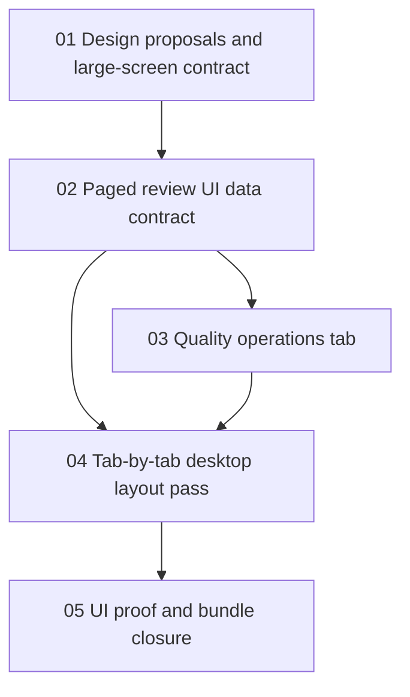

# Phase Plan

## Execution Order

1. Subbundle 01 locks design proposals and the large-screen contract.
2. Subbundle 02 adds the paged review UI data contract and bounded query implementation.
3. Subbundle 03 adds the Quality operations tab and quality action handlers.
4. Subbundle 04 improves every tab with consistent desktop pane layout, counts, and pagers.
5. Subbundle 05 runs build/test/browser proof and closes the bundle.

## Subbundle Dependency Map

## Critical Subbundles

- Subbundle 01 is critical because the large-screen-only rule changes what proof is required and what CSS is forbidden.
- Subbundle 02 is critical because UI paging is meaningless if the service still loads full tables.
- Subbundle 03 is critical because the prior quality functions are not complete from an operator perspective until they are reachable.
- Subbundle 04 is critical because every tab must be improved consistently, not only the new tab.
- Subbundle 05 is critical because UI work requires browser proof, not only tests.

## Phase Gates

| Gate | Required proof |
|---|---|
| Gate A - Design contract | Imagegen artifacts preserved; large-screen-only and no medium/small tuning rules are recorded. |
| Gate B - Paging data | Per-collection page requests, page metadata, and DB-level page windows are implemented and tested. |
| Gate C - Quality operations | Diagnostics, clustering, dream run, and aggregate apply access exists in the UI and is testable. |
| Gate D - Tab pass | Every tab has consistent large desktop layout and visible paging where a list can grow. |
| Gate E - Closure | Build, unit/component tests, browser proof, prepared validator, and completed validator pass. |
