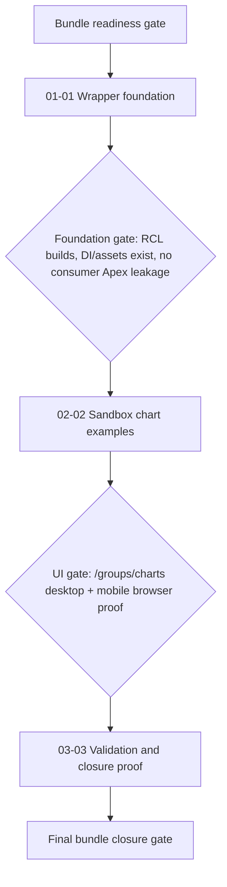

# Phase Plan

## Phase Sequence

1. Prepare and validate this bundle before implementation.
2. Execute `01-01-wrapper-foundation`: add the charts RCL, public models, Apex adapter, DI registration, and assets.
3. Run the subbundle closure gate; because this is a critical foundation, build the new RCL and confirm the public contract does not leak Apex components.
4. Execute `02-02-sandbox-chart-examples`: add the sandbox chart group/page and representative examples.
5. Run browser proof for `/groups/charts` on desktop and mobile before the sandbox subbundle can close.
6. Execute `03-03-validation-and-closure-proof`: run final builds/tests, record raw-note closure, browser analytics review, and final bundle validators.

## Subbundle Dependency Map

## Critical Subbundles

- `01-01-wrapper-foundation` is a critical foundation. If its API leaks Apex-specific public component requirements, downstream sandbox proof does not prove future replaceability.
- `02-02-sandbox-chart-examples` is a critical UI proof phase. If charts do not render in a real browser, build success is insufficient.

## Phase Gates

- Gate after preparation: run the bundle validator and repair failures.
- Gate before each subbundle: read the subbundle README, confirm prerequisites, exact source references, and current repo state.
- Gate after `01-01`: `dotnet build` for the new charts RCL passes, adapter contract is documented, and sandbox can reference the project.
- Gate after `02-02`: route `/groups/charts` is browser-tested with desktop and mobile screenshots plus DOM checks for rendered chart content.
- Gate before closure: rerun validators, close raw notes against code/proof, and reopen anything with weak proof.
