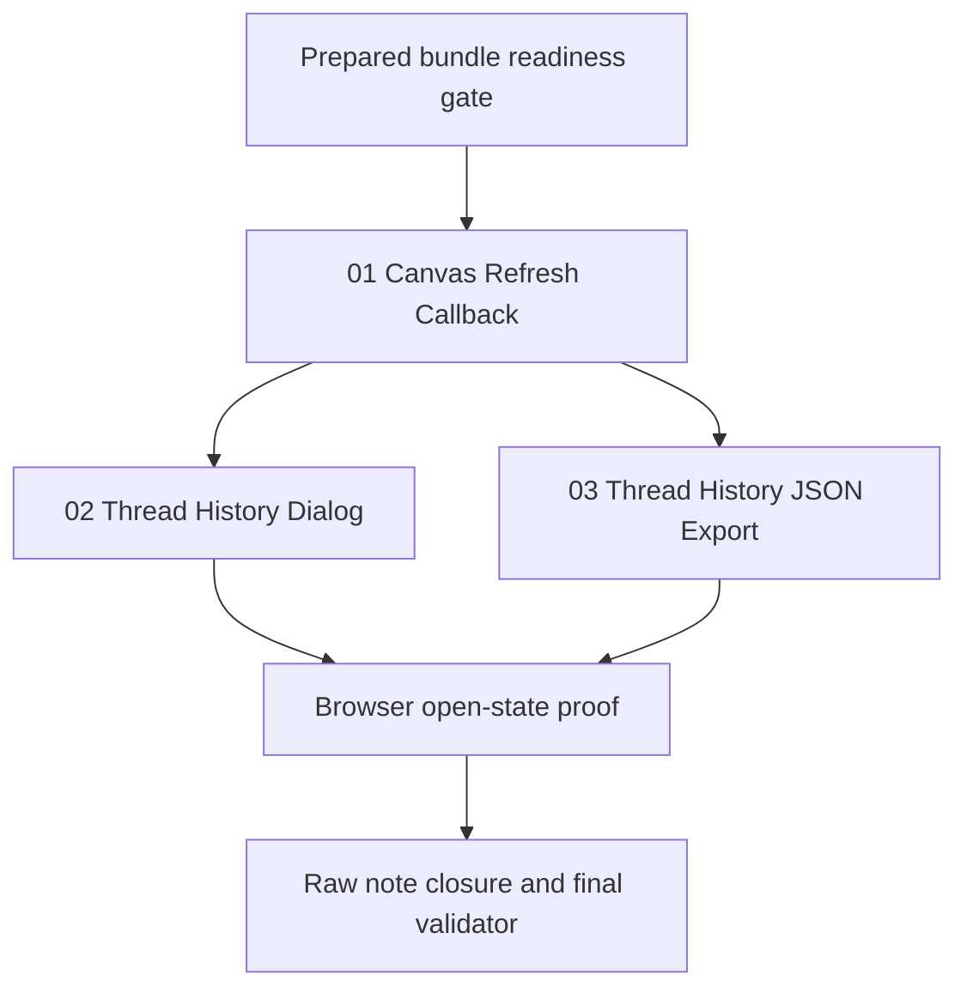

# Phase Plan

## Phase Sequence

1. Prepare and validate the bundle.
2. Execute Subbundle 01, then prove project and process canvas refresh preserve UI state.
3. Execute Subbundle 02, then prove the history dialog opens and selects a thread without breaking agent-row double-click behavior.
4. Execute Subbundle 03, then prove JSON export contains runtime/tool evidence and downloads from the floating chat window.
5. Run final tests, browser proof, raw-note closure, and completed bundle validation.

## Subbundle Dependency Map

- Subbundle 01 is the shared canvas-state foundation for both UI follow-ons.
- Subbundles 02 and 03 can be implemented after Subbundle 01 because they share the contextual window but do not depend on each other.

## Critical Subbundles

- `01-canvas-refresh-callback`: Critical UI foundation. It must prove live canvas state capture and parent refresh do not reset pan, zoom, selection, or open floating windows.
- `02-thread-history-dialog`: UI workflow foundation for reopening historical threads from the agent list.
- `03-thread-history-json-export`: Debug-data foundation; closure requires inspecting payload shape, not only button rendering.

## Phase Gates

- Gate after preparation: run `validate_bundle.py --stage prepared` and manual readiness review.
- Gate before Subbundle 01: exact source references exist and parent canvas state ownership is understood.
- Gate after Subbundle 01: targeted tests/build pass and browser/component proof shows refresh preservation.
- Gate after Subbundle 02: history dialog open-state proof shows no clipping/layering issue and row double-click still works.
- Gate after Subbundle 03: JSON payload includes thread, run, and tool receipt detail; browser download action is present.
- Gate before closure: run targeted tests/build, fill browser analytics, close every raw note, and run completed validation.
