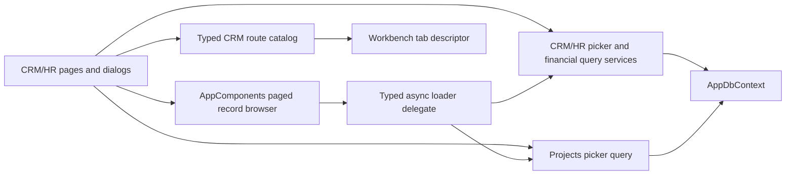

# Target Solution

## End State

CRM/HR retains its existing routed workbench and domain model while replacing high-cardinality dropdown/in-memory behavior with a typed async data boundary. Large pages orchestrate cohesive components and query services; they do not own paging, financial aggregation, or reusable dialog mechanics.

## Frontend Prebuild Decisions

- Visual thesis: calm, dense, professional large-screen CRM with one dominant working surface.
- Content plan: compact header/navigation; searchable primary list; detail tabs; dialogs for independent create/edit flows; Financials as task-first analytics.
- Interaction thesis: restrained dialog entrance/focus, card/list selection transitions, and filter/loading-state feedback; no ornamental motion.
- Primary surfaces: Directory/CRM lists and selected account detail remain dominant. Supporting filters/counts stay compact; Financials alone promotes metrics/charts.
- First viewport: header, secondary navigation, list filters, and useful list/detail content are visible at `1800x1100` without page-level introductory cards.
- Scroll ownership: routed `ListDetailShell` panes own workbench scrolling; dialog body owns overlay scrolling; record-browser content expands/paginates inside its host and does not create an accidental nested viewport.

## Shared Record Browser Boundary

`CanDoItAll.AppComponents` owns domain-neutral records and mechanics:

- typed record key;
- display metadata and tags;
- typed filter payload;
- zero-based page request and total-bearing page result;
- typed async loader delegate with cancellation;
- search/tag/type controls, pager, selection, retry, and explicit loading/empty/error states;
- a reusable browser body plus a wide `Dialog` host; standalone lists reuse the same browser body.

CRM/HR owns a query service that maps parties/accounts/other CRM records to the neutral presentation contract. Projects owns its project query mapping. The shared project must not reference either domain module.

The existing `PartyPicker` may remain only as a thin CRM/HR adapter/host over this boundary. It must not retain a hidden unpaged `Options` fallback.

## Contact Boundary

- A dialog-owned two-step wizard holds an isolated draft.
- The step enum is a small closed state machine; Back/Next/Cancel/Finish transitions are explicit.
- The live contact list changes only on successful Finish or explicit removal of an existing stable item.
- Contact tags use `TagEditor` and persist through a backward-compatible `TagsJson` column/default.
- Migration, import/export, merge, snapshot/redaction, mapping, and validation paths are audited together; errors are surfaced.

## Opportunity Boundary

- `OpportunityBoard`/pipeline becomes the reusable browsing surface with typed filters and callbacks.
- CRM page owns only selected account/opportunity ids, active tab, and dialog-open orchestration.
- Create wizard, read-only detail, and edit dialog are separate components with isolated drafts.
- Owner, delivery unit, related party, and related project selection use typed picker adapters.
- Project query logic remains in Projects; opportunity persistence remains in CRM/HR.
- Existing conversion behavior remains available and must not become the only way to link a project.

## Financial Boundary

- A top-level `CrmFinancialSnapshotQueryService` (or equivalently cohesive read-projection type) owns aggregation and typed availability.
- It returns currency-separated metrics, deterministic month/year series, distribution series, and `Available`/`Empty`/`Unavailable` states.
- CRM page renders a dedicated Financials component and does not calculate totals.
- Bought and overdue remain unavailable until authoritative sources exist. No fallback values or fake series are allowed.
- `CdaChart` is the chart renderer; existing web host assets are reused.

## Contextual Title Boundary

- CRM/HR exposes a typed static route catalog (route, secondary key/label, concise workbench title, description) consumed by `CrmHrSecondaryTabs` and Web's `BuildPageDescriptor` before the generic shell-navigation fallback.
- Workbench descriptors preserve stable route/artifact/restore identity while displaying concise titles with the distinguishing token early, such as `CRM · Directory`, `CRM · Workforce`, and `CRM · Recruiting`; this matters because `AppTabStrip` truncates visible labels to `9rem`.
- Account/opportunity names may enrich titles only after safe resolution and without exposing sensitive data; static route context is the required minimum.
- Do not register CRM child routes through `IShellNavigationContributor` solely for titles: current shell composition flattens contributors into main navigation and ignores `IsSubItem`.
- Route constants are centralized rather than copied as magic strings across secondary tabs, chat surfaces, and workbench metadata when the smallest change permits.

## Allowed Side Effects

- Add a one-way `CrmHr -> AppComponents` project reference after cycle proof.
- Add Charts 0.1.4 to CRM/HR and its import after library/setup verification from existing repository usage.
- Add top-level components, query services, typed records/enums/delegates, tests, DI registrations, and a contact-tag migration.
- Shrink or thin existing picker/editor/page code as responsibilities move.

## Forbidden End States

- Client-side pagination over an eagerly loaded thousand-record list.
- A generic component containing CRM/HR or Projects types.
- A service interface implemented only by the existing 6,054-line service without an independent seam.
- New `CrmHrServices.*.cs` or page partial files used to hide feature growth.
- Permanent opportunity editor stacked under the list.
- Unavailable financial data rendered as zero.
- Radzen, new ad hoc design primitives, or mobile scope.
