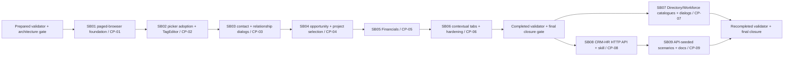

# Phase Plan

## Phase Sequence

1. Validate the prepared initiative bundle and pass the architecture preparation gate.
2. Execute SB01 and prove the neutral paged-browser foundation before any broad adoption.
3. Execute SB02 and SB03 sequentially so tag/picker adoption precedes contact persistence and relationship flows.
4. Execute SB04 before SB05 because both change the CRM workspace and Financials depends on opportunity truth.
5. Execute SB06 only after every earlier checkpoint passes; finish with broad validation and raw-note closure.
6. Reopen the completed bundle for the follow-up. Execute SB07 and SB08 independently when useful.
7. Execute SB09 only after SB08 passes; final closure waits for both SB07 and SB09.

## Subbundle Dependency Map

- A failed checkpoint reopens its owning subbundle and all downstream proof that depends on the failed contract.
- SB04 and SB05 must not run in parallel because they both own `CrmHrCrmPage.razor`.
- SB07 and SB08 are parallel-safe because they own UI/catalog and Web API/skill surfaces respectively.
- SB09 depends on SB08 and supplies populated-data browser proof used by final SB07/SB09 closure.

## Critical Subbundles

- Every subbundle uses `Behavioral` proof.
- SB01 is the critical shared foundation; its downstream assignment picker must prove the neutral browser is active.
- SB03 is the persistence/correctness foundation; its migration round trip and exact crash regression must pass before opportunity work.
- SB04 establishes opportunity/project truth consumed by SB05.
- SB06 is the closure gate and may reopen any earlier work.
- SB07 reopens the shared ordinary-list/title interpretation.
- SB08 is the critical HTTP/skill foundation for SB09.
- SB09 is the new final closure gate.

## Phase Gates

- Gate after preparation: run the bundle validator and repair failures.
- Gate before each subbundle: confirm prerequisites are complete and still valid.
- Gate after each subbundle: capture proof, review screenshots, and decide whether downstream work may continue.
- Gate before closure: rerun validators, close raw notes, and reopen anything with weak proof.

## UI Target Policy

- CanDoItAll applications target large-screen desktop viewports. Do not add small/medium/mobile tuning unless explicitly requested.
- Reusable basic `CanDoItAll.Components.BaseLib` work validates small, medium, and large viewports.
