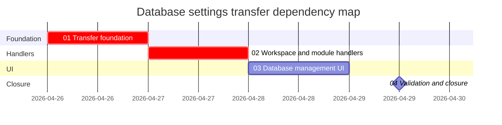

# Phase Plan

## Phase Sequence

1. Build the Infrastructure transfer foundation and DI seam.
2. Add module-specific transfer handlers for Workspace, AgentFramework, and Processes.
3. Add the database-management and new-database transfer UI.
4. Run validation, browser proof, closure audit, and final bundle sync.

## Subbundle Dependency Map

## Critical Subbundles

- `01-01-transfer-foundation` is a critical foundation. All later behavior depends on explicit source/target database opening and handler dispatch.
- `02-02-workspace-transfer-handlers` is a critical foundation for user-visible correctness because the ProjectStructure token fix and initial checkbox list depend on real handlers.
- `03-03-database-management-ui` is a critical UI foundation because the raw request requires a modal, source DB list, and checkboxes.

## Phase Gates

- Preparation gate: bundle validator must pass with every raw requirement mapped.
- Gate before `01`: source references exist and generic abstraction ownership is confirmed.
- Gate after `01`: build succeeds or compile errors are bounded to missing downstream registrations; handler registration path is clear.
- Gate after `02`: all required transfer items have handlers and no module reference cycles are introduced.
- Gate after `03`: browser proof captures the open modal, checkbox list, source selector, and new-database prompt behavior.
- Closure gate: targeted build/tests, browser analytics, raw note closure, and final bundle validator pass or record explicit blockers.
