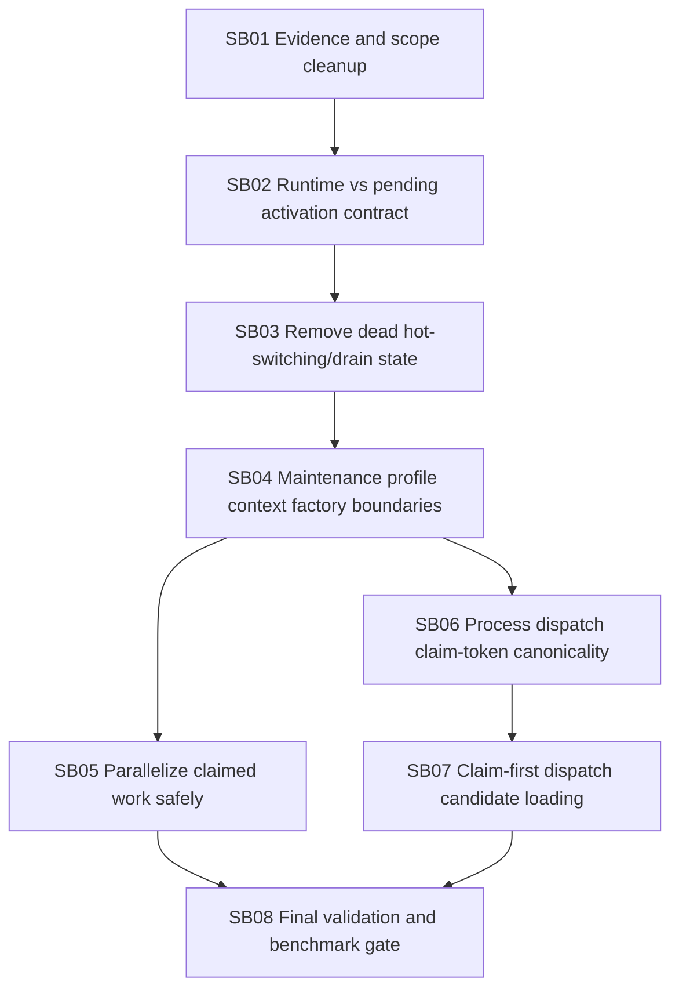

# candoitall-db-postgres-canonicality-and-throughput-followup-bundle-v3

## Status

Executed by Codex on 2026-05-24 with documented validation caveats.

## Target repository and branch

- Repository: `fyziktom/CanDoItAll`
- Target branch: `db-remove-sqlite`
- Comparison baseline reviewed: `development`
- Review timestamp: `2026-05-24T16:34:04Z`

## Executive summary

Codex completed the major SQLite removal and PostgreSQL-only conversion work much better in the latest iteration:

- The branch is now ahead of `development` and no longer behind in the GitHub compare result.
- SQLite was removed from the typed database profile model.
- Normal `AppDbContext` creation now uses a canonical runtime database profile and `AddPooledDbContextFactory`.
- Database activation is restart-first rather than hot-switching the live runtime.
- PostgreSQL batch claim primitives were introduced for automation, connector, and process outbox work.
- Process step dispatch now has durable dispatch claim fields instead of relying only on long process-local semaphore ownership.

However, this is not done yet. The next work should focus on canonicality and throughput correctness:

1. Remove or collapse the now-dead hot-switching/drain state that still exists in `DatabaseRuntimeSwitching.cs`.
2. Split "running canonical profile" from "pending activation for next restart" in UI/API/domain contracts.
3. Remove misleading `EnableMaintenanceHotSwitch` unless Codex implements a real, explicit, operator-only maintenance path.
4. Make batch-claimed outbox/delivery work actually process with bounded PostgreSQL-safe parallelism instead of claiming a batch and then processing it sequentially.
5. Strengthen process dispatch claim-token canonicality so stale long-running executions cannot commit transitions after their durable claim expired or was stolen.
6. Reduce `LoadDispatchCandidateAsync` bottlenecks by moving toward claim-first loading and avoiding heavy full-run scans before a durable claim is acquired.
7. Clean scope/evidence noise before merge.

## Subbundle dependency map

## Critical foundation subbundles

- `SB02`: prevents UI/API from mixing the persisted next-start profile with the runtime canonical database.
- `SB03`: removes obsolete switch/drain semantics that can mislead future agents and operators.
- `SB06`: protects process truth from stale or stolen dispatch claims.
- `SB07`: changes how process automation candidates are selected and must preserve process semantics.

## Do not touch

- `CanDoItAll.IPFS` SQLite local store. It is out of scope and remains valid.
- Do not reintroduce SQLite provider, SQLite migrations, SQLite snapshot runtime, or SQLite compatibility branches.
- Do not make live DB hot-switching a default path.

## Expected final report

Codex must produce an execution report that explicitly distinguishes:

- What was changed.
- What was intentionally left as future work.
- Which validations were run.
- Which validations failed or were quarantined.
- Measured before/after throughput or at least deterministic concurrency stress proof.
- Any canonicality risks still open.

## Execution result

- Final report: `proof/SB08/final-execution-report.md`
- Benchmark/concurrency proof: `proof/SB08/benchmark-report.md`
- Bundle validator transcript: `proof/SB08/transcripts/bundle-validator-completed.txt`
- Main caveat: broad integration/component suites need a clean CI rerun after local PostgreSQL authentication and timeout constraints are resolved.
