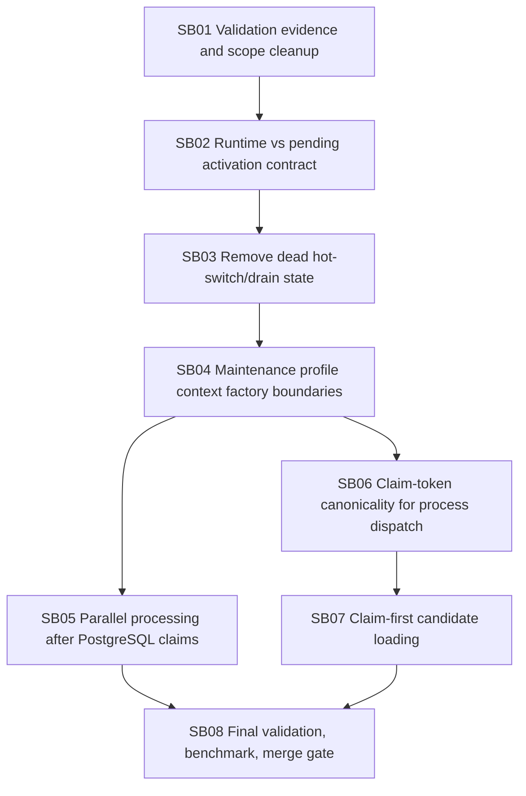

# Phase plan

## Subbundle Dependency Map

## Critical Subbundles

- SB02: canonical UI/API state split.
- SB03: removes dead switch/drain semantics.
- SB06: process mutation ownership.
- SB07: process candidate loading and scheduler semantics.

## Phase Gates

- Do not start SB05 before SB04 proves profile-specific context creation is maintenance-only.
- Do not start SB07 before SB06 proves stale dispatch claims cannot commit.
- Do not close SB08 until concurrency stress tests prove no duplicate processing and no stale claim commits.
