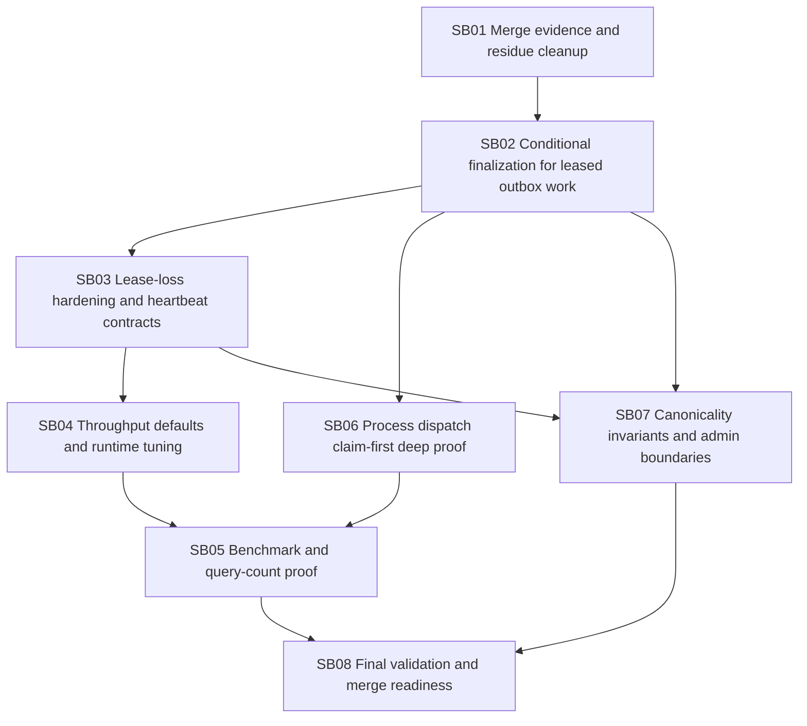

# Phase plan

## Subbundle dependency map

## Critical subbundles

- SB02 is critical: stale finalization can corrupt canonical state.
- SB03 is critical: heartbeat loss semantics define whether claims are trustworthy.
- SB07 is critical: prevents future source-of-truth drift.

## Phase gates

- Do not tune defaults in SB04 until SB02/SB03 prove stale workers cannot commit.
- Do not accept benchmark proof in SB05 unless duplicate-execution negative tests pass.
- Do not merge until SB08 closes broad test caveats or records explicit quarantines with owners.
