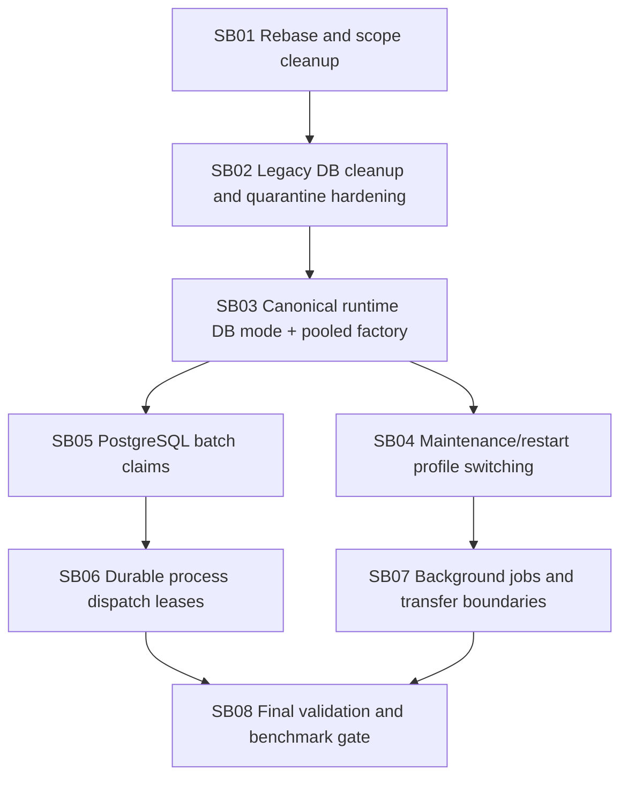

# Phase plan

## Subbundle dependency map

## Critical subbundles

- SB02: legacy quarantine correctness prevents startup/catalog failure.
- SB03: canonical runtime DB architecture changes the normal DbContext hot path.
- SB05: PostgreSQL batch claim changes durable execution semantics.
- SB06: process dispatch claim changes canonical process execution semantics.
- SB08: final validation determines merge readiness.

## Phase gates

### Gate after SB01

- Branch is current with `development`.
- Scope/evidence noise is either removed or intentionally documented.

### Gate after SB02

- Retired-provider residue audit passes with explicit allowlist.
- Legacy catalog quarantine tests pass for both string and numeric legacy provider/source values.

### Gate after SB03

- Normal DbContext creation no longer uses runtime switch lease or per-context profile resolution.
- Pooled canonical context proof exists.
- Admin profile-specific factory still works.

### Gate after SB04

- Data Sources activation no longer silently hot-switches production runtime.
- Restart/maintenance semantics are visible in UI/API/tests.

### Gate after SB05

- Batch claim tests prove no duplicate claims under concurrent workers.

### Gate after SB06

- Process step dispatch tests prove no duplicate execution and no unnecessary serialization across different steps.

### Gate after SB08

- Full validation suite passes or every non-passing item is explicitly quarantined with reason and owner.
