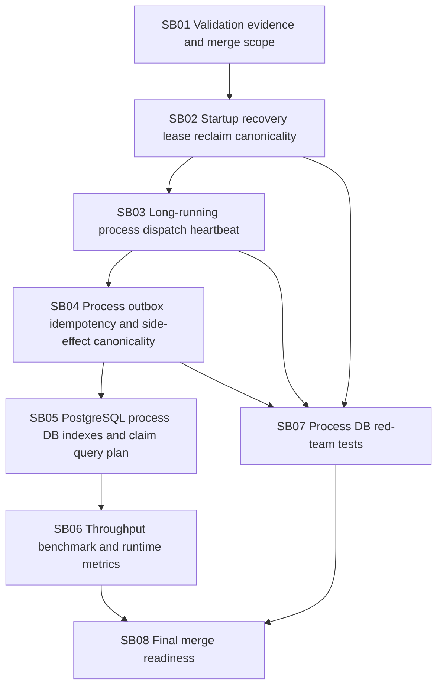

# Phase plan

## Subbundle dependency map

## Critical subbundles

- SB02: protects canonical lease ownership during recovery.
- SB03: protects long-running process execution from claim expiry.
- SB04: prevents duplicate side effects after lease loss/retry.
- SB07: proves the concurrency fixes semantically.

## Phase gates

Do not run benchmark/merge gates until SB02-SB04 pass semantic red-team tests.

Do not merge if broad validation remains unexplained or if a process worker can mutate state after losing a lease.
