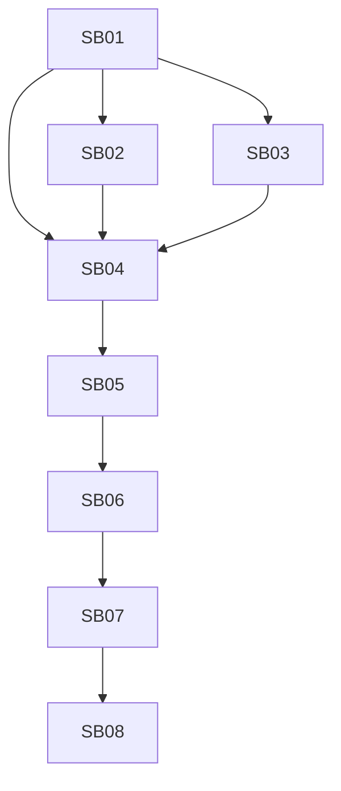

# CanDoItAll SQLite Removal Follow-up Bundle v1

Target repository: `fyziktom/CanDoItAll`  
Target branch: `db-remove-sqlite`  
Base branch for review: `development`

## Purpose

Codex already performed the first PostgreSQL-only runtime pass. This follow-up bundle focuses on the remaining cleanup and hardening required before the branch should be merged:

1. remove SQLite from the main runtime domain model completely,
2. eliminate leftover legacy SQLite branches from control-plane, startup, UI, and database switching,
3. decide whether snapshot stubs stay as explicit future-work documentation or are removed from runtime services,
4. verify PostgreSQL baseline migration model drift,
5. add PostgreSQL-specific runtime/workflow/process concurrency tuning that was not clearly implemented in the first pass,
6. clean unrelated artifacts and stale reports that were introduced or modified on the branch,
7. provide a strict final validation gate.

## Important constraint

`CanDoItAll.IPFS` is out of scope. Its SQLite usage is an isolated local utility index in a different repository and must not drive decisions in this repo.

## Review summary

Codex completed a meaningful first pass:

- `src/CanDoItAll.Migrations.Sqlite` was removed from the solution.
- `Microsoft.EntityFrameworkCore.Sqlite` was removed from `CanDoItAll.Infrastructure`.
- `SqliteWriteCoordination.cs` was removed.
- PostgreSQL became the default runtime provider in the app options and design-time factory.
- PostgreSQL baseline migration exists.
- Test support was moved away from SQLite toward PostgreSQL/InMemory.
- Snapshot flows were reduced to deferred failures.
- Data Sources UI no longer offers new/open SQLite actions.

However, the implementation is not a true "SQLite removed completely" state yet. The core model still contains SQLite enum values and SQLite profile types, control-plane/startup still have SQLite branches, UI still has a legacy SQLite display branch, and stale SQLite catalog entries can still brick startup/resolution by throwing from the resolver. PostgreSQL workflow/process tuning also still needs a focused implementation pass.

## Subbundles

| ID | Name | Goal |
|---|---|---|
| SB01 | Hard-remove SQLite domain model and legacy catalog quarantine | Remove SQLite enum/source/model leftovers and replace legacy support with raw JSON quarantine. |
| SB02 | Clean Data Sources UI | Remove all SQLite/InMemory runtime editor remnants and keep the UI PostgreSQL-focused. |
| SB03 | Remove snapshot runtime stubs | Remove/de-scope database snapshot service/model bloat until snapshots are reintroduced as a separate portable workflow. |
| SB04 | Test and residue audit hardening | Add hard residue tests and update test support for PostgreSQL-only runtime. |
| SB05 | PostgreSQL baseline drift proof | Prove the single baseline migration matches the current EF model and can create a fresh DB. |
| SB06 | PostgreSQL runtime workflow/process tuning | Replace SQLite-era neutral/single-writer assumptions with PostgreSQL-safe claim/lock patterns. |
| SB07 | Unrelated change and evidence cleanup | Review and revert/separate unrelated branch changes and stale reports. |
| SB08 | Final validation and merge gate | Build/test/browser/grep evidence with clear pass/fail gates. |

## Execution order

## Validation Summary

- Bundle preparation status: `Prepared`
- Bundle readiness gate: `Passed after compatibility repair`
- Execution status: `Completed with residual suite risks`
- Subbundle gate review: `Completed`
- Final closure gate: `Passed with notes`
- Browser validation analytics: `Completed`
