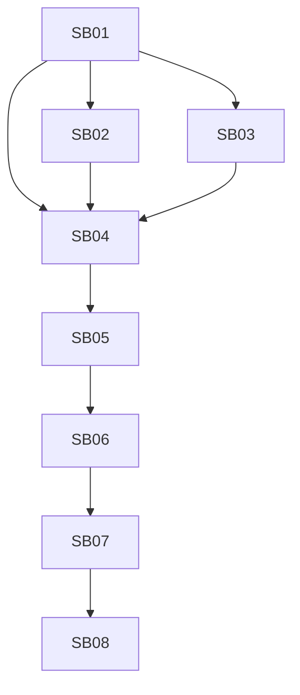

# Follow-up phase plan

## Phase 1: Hard model cleanup

Subbundles:
- SB01
- SB02
- SB03

Goal:
- make SQLite impossible to reference from main runtime code,
- keep app startup safe through legacy catalog quarantine,
- remove UI/runtime snapshot dead surface.

## Phase 2: Test and migration proof

Subbundles:
- SB04
- SB05

Goal:
- add hard residue checks,
- prove PostgreSQL-only baseline is valid,
- prove clean DB creation and no EF model drift.

## Phase 3: Runtime tuning

Subbundle:
- SB06

Goal:
- use PostgreSQL runtime capabilities in process/workflow/automation paths,
- add concurrency negative tests.

## Phase 4: Cleanup and merge gate

Subbundles:
- SB07
- SB08

Goal:
- remove unrelated branch artifacts/stale reports,
- produce final merge-ready proof.

## Execution Order

- SB01 before SB02, SB03, and SB04.
- SB04 before SB05.
- SB05 before SB06.
- SB06 before SB07.
- SB07 before SB08.

## Subbundle Dependency Map

## Critical Subbundles

- SB01
- SB02
- SB03
- SB04
- SB05
- SB06
- SB07
- SB08

## Phase Gates

- Phase 1 gate: build succeeds after model, UI, and snapshot runtime cleanup.
- Phase 2 gate: residue audit and PostgreSQL baseline proof pass.
- Phase 3 gate: durable runtime concurrency tests pass.
- Phase 4 gate: final validation evidence and execution report are updated.
