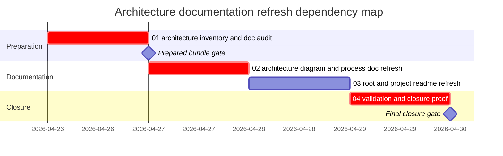

# Phase Plan

## Phase Sequence

1. `01-architecture-inventory-and-doc-audit`: verify actual architecture, stale docs, and README coverage.
2. Prepared gate: run `validate_bundle.py --stage prepared` and manual readiness review.
3. `02-architecture-diagram-and-process-doc-refresh`: author current architecture-beta doc with diagrams and AI-agent process detail.
4. `03-root-and-project-readme-refresh`: refresh root/docs/component docs and add project README coverage.
5. `04-validation-and-closure-proof`: run docs-specific validation, close raw notes, and run final closure validator.

## Subbundle Dependency Map

## Critical Subbundles

- `01-architecture-inventory-and-doc-audit` is a critical foundation. If its source references or architecture model are wrong, every downstream doc becomes untrustworthy. Deeper validation: exact source references and README coverage audit.
- `02-architecture-diagram-and-process-doc-refresh` is a critical foundation for README and project docs. Deeper validation: text checks for required Mermaid diagram families and process AI-agent flow coverage.
- `04-validation-and-closure-proof` is critical for final closure. Deeper validation: README coverage script, `git diff --check`, raw note closure, and final bundle validator.

## Phase Gates

- Gate after preparation: run `python C:\Users\lucys\.codex\skills\candoitall-bundle-preparation\scripts\validate_bundle.py --stage prepared C:\repositories\CanDoItAll\codex\bundles\docs-architecture-refresh-2026-04-26`.
- Entry gate for `01`: source references exist and raw request is preserved.
- Closure gate for `01`: inventory files identify actual runtime architecture and stale docs.
- Entry gate for `02`: `01` completed and architecture facts are source-grounded.
- Closure gate for `02`: architecture doc includes `architecture-beta`, C4, and sequence diagrams plus process AI-agent details.
- Entry gate for `03`: `02` completed and root README can link to the detailed doc.
- Closure gate for `03`: root README, docs indexes, shared-component docs, and per-project READMEs are updated.
- Entry gate for `04`: docs work completed.
- Closure gate for `04`: validation commands are recorded, raw note closure is complete, and final validator passes or any blocker is explicit.
