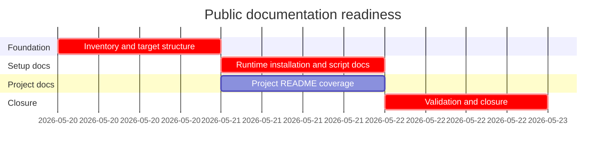

# Phase Plan

## Execution Order

1. `01-doc-inventory-and-target-structure`: confirm current docs/scripts/project inventory and update doc navigation targets.
2. `02-runtime-installation-and-script-docs`: update root/runtime docs for PostgreSQL, Qdrant, app install, MCP resetup, and skill installation.
3. `03-project-readme-coverage`: add missing project READMEs and keep each description source-grounded.
4. `04-validation-and-closure`: run coverage/build/bundle validation, close raw notes, and update execution evidence.

## Subbundle Dependency Map

## Critical Subbundles

- `01-doc-inventory-and-target-structure` is a critical foundation. Wrong inventory invalidates project README coverage and setup claims.
- `02-runtime-installation-and-script-docs` is critical for public setup. It must match actual scripts/config before closure.
- `04-validation-and-closure` is critical because Markdown changes have little compiler enforcement; coverage and build proof decide whether the request is actually closed.

## Phase Gates

- Prepared gate: run `validate_bundle.py --profile initiative --stage prepared` and repair failures before implementation.
- Entry gate for each subbundle: confirm listed source references exist and prerequisites are complete.
- Closure gate for subbundle 01: inventory results are recorded and source references are current.
- Closure gate for subbundle 02: root/runtime docs mention PostgreSQL, Qdrant, app install, MCP resetup, and skill installation using real commands.
- Closure gate for subbundle 03: project README coverage check reports no missing README.
- Final closure gate: run completed-stage bundle validation, project README coverage check, and `dotnet build CanDoItAll.slnx --no-restore` or record a concrete blocker.
