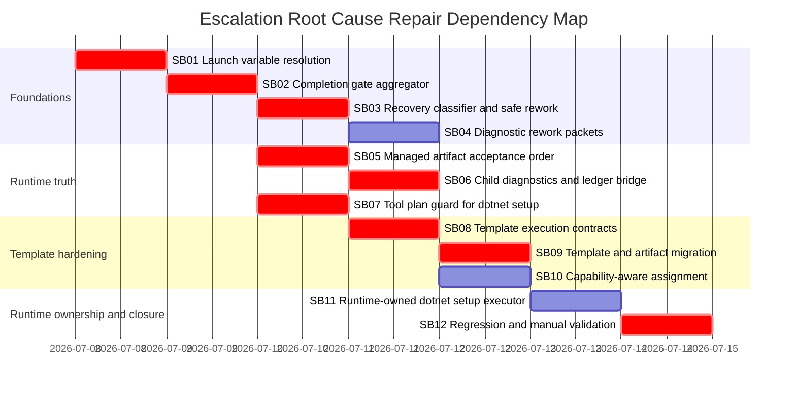

# Phase Plan

## Phase Sequence

1. SB01 resolves launch-variable placeholders and blocks unresolved tool-critical values.
2. SB02 replaces first-failure completion validation with aggregate completion gates.
3. SB03 routes safe/idempotent completion-gate diagnostics to bounded current-step rework.
4. SB04 builds diagnostic-specific rework packets from aggregate gate results.
5. SB05 fixes managed artifact staging, acceptance, and wording order.
6. SB06 propagates child diagnostics and uses ledger/slot truth for subprocess artifact bridging.
7. SB07 adds typed tool-plan guard coverage for .NET solution setup.
8. SB08 adds template schema execution contracts and validation.
9. SB09 audits and migrates all process, step, prompt, validation, and artifact templates.
10. SB10 hardens capability-aware agent assignment and exact tool preflight.
11. SB11 introduces runtime-owned .NET solution setup execution after the guard is proven.
12. SB12 runs regression, manual 5032/equivalent validation, and architecture closure.

## Execution Order

| Order | Subbundle | Depends on | Why |
| --- | --- | --- | --- |
| 1 | SB01 | None | All tool refs and rework packets depend on resolved variables. |
| 2 | SB02 | SB01 | Aggregation must use resolved paths and receipts. |
| 3 | SB03 | SB02 | Recovery classification depends on structured aggregate diagnostics. |
| 4 | SB04 | SB01, SB02, SB03 | Rework packets need resolved values, aggregate issues, and recovery policy. |
| 5 | SB05 | SB02 | Artifact acceptance must respect completion gate results. |
| 6 | SB06 | SB02, SB05 | Child bridge must use accepted slots and aggregate diagnostics. |
| 7 | SB07 | SB01, SB02 | Tool plan guard needs resolved variables and required receipt semantics. |
| 8 | SB08 | SB01, SB02, SB06, SB07 | Template schema contracts mirror runtime semantics. |
| 9 | SB09 | SB08 | Migration should happen after validators exist. |
| 10 | SB10 | SB07, SB08 | Assignment must use typed execution/tool metadata. |
| 11 | SB11 | SB07, SB10 | Runtime-owned executor should follow proven guard/capability contracts. |
| 12 | SB12 | All prior | Final validation closes the complete failure class. |

## Subbundle Dependency Map

## Critical Subbundles

| Subbundle | Critical reason | Downstream phases blocked until pass |
| --- | --- | --- |
| SB01 | Unresolved placeholders are a root cause and make every repair packet unsafe. | SB02, SB04, SB07, SB08, SB09. |
| SB02 | Aggregated diagnostics are the source of recovery and rework truth. | SB03, SB04, SB05, SB06, SB12. |
| SB03 | Prevents safe/idempotent gate failures from escalating directly. | SB04, SB12. |
| SB05 | Prevents false artifact acceptance and misleading runtime wording. | SB06, SB09, SB12. |
| SB06 | Parent processes must receive child root cause and accepted artifact slots. | SB09, SB12. |
| SB07 | Stops deterministic .NET setup failures before agent execution repeats them. | SB08, SB10, SB11, SB12. |
| SB08 | Typed schema is required before broad template migration. | SB09, SB10, SB12. |
| SB09 | User explicitly required all process and artifact templates to be covered. | SB12. |
| SB12 | Final proof closes the incident and systemic template scope. | Final closure. |

## Phase Gates

### Prepared Gate

- Run the prepared bundle validator with profile `initiative`.
- Confirm every GPTPro finding maps to a requirement and subbundle.
- Confirm CodeAnalytics snapshot and dependency direction are recorded.
- Confirm all high-risk templates and all six artifact templates are included in inventory.

### Entry Gate For Every Subbundle

- Reopen this bundle root, the subbundle README, `requirements/01-normalized-requirements.md`, `traceability/01-requirement-traceability.md`, and relevant architecture files.
- Refresh exact source references if production code or templates changed since bundle preparation.
- If the phase touches architecture-heavy code, run a scoped CodeAnalytics check before editing where available.

### Closure Gate For Every Critical Subbundle

- Update `reviews/01-execution-report.md`.
- Populate `proof/SBxx/manifest.md` and `proof/SBxx/semantic-invariants.md`.
- Include failing-first and passing test transcripts for behavior changes.
- Include source assertions, changed-file hashes, anti-stub audit, and production behavior artifact matrix when new records, states, events, or lifecycle signals are introduced.
- Run relevant unit, integration, template validation, and architecture boundary tests.
- Run `reviews/csharp-architecture-gate.md` before dependent phases proceed.

### Reopen Gate

Reopen earlier phases when:

- a tool-critical unresolved placeholder reaches an agent or rework packet;
- a safe/idempotent completion issue still escalates before budget exhaustion;
- parent subprocess diagnostics lose child root cause;
- artifact bridge accepts physical file existence without ledger/slot acceptance;
- any process or artifact template keeps hard gates in prose only;
- template validation does not fail for missing typed metadata;
- a runtime-owned executor bypasses the tool-plan guard contract.

### Final Closure Gate

- Run the completed bundle validator.
- Refresh CodeAnalytics evidence and confirm no new cycles.
- Run the targeted test suite and broader build/test commands required by changed projects.
- Capture manual 5032 recovery evidence or an equivalent local reproduction with explicit blocker notes.
- Close every GPTPro finding and user requirement as solved, partially solved, or not solved with proof.
