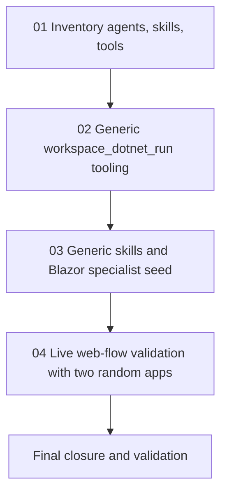

# Phase Plan

## Phase Sequence

1. Inventory active seeded agents, skills, tool plumbing, and sample-specific text.
2. Implement and test generic `.NET run` workspace tooling.
3. Update generic .NET/Blazor skills and seed the specialized Blazor developer agent.
4. Rebuild/restart the web app and validate two unrelated app-build process flows under `C:\programovani\dotnet`.
5. Close the bundle with source scans, tests, browser/process evidence, and raw-note closure.

## Subbundle Dependency Map

## Critical Subbundles

- `02-dotnet-run-tooling` is a critical foundation. Later live process validation is not meaningful if agents still need ad hoc launch scripts.
- `03-generic-agent-and-blazor-specialist-seeds` is a critical foundation. Live validation must exercise refreshed generic instructions and the Blazor specialist option.
- `04-live-web-flow-validation` is the final behavior proof. It must not pass if either app requires manual source repair.

## Phase Gates

- Gate after preparation: run the bundle validator and repair failures.
- Gate after subbundle 01: inventory must identify every active seed/tool surface being changed.
- Gate after subbundle 02: unit tests prove `workspace_dotnet_run` is exposed and command planned correctly.
- Gate after subbundle 03: integration tests prove updated skills, run tool assignment, managed refresh, and Blazor specialist seeding.
- Gate after subbundle 04: browser/process evidence proves two unrelated app builds run through the web flow without manual app repair.
- Gate before closure: rerun bundle validator, focused tests, source scans, and final raw-note closure.
