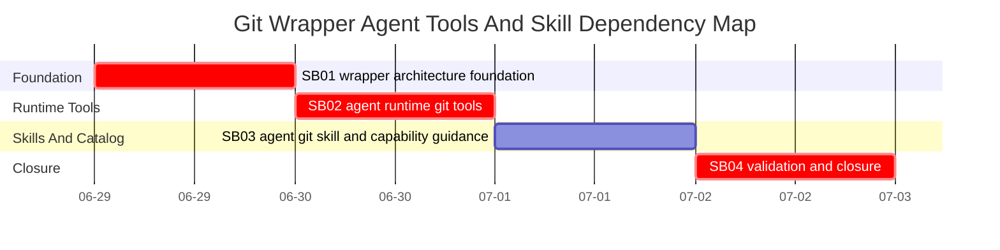

# Phase Plan

## Phase Sequence

1. SB01: refactor and harden the shared git wrapper, then prove command specs independent of the agent runtime.
2. SB02: expose the bounded git tool set through workspace command execution, MAF runtime tool composition, and policy/access metadata.
3. SB03: update template-backed tool descriptors, add the git operations inline skill, and assign capabilities to default agents.
4. SB04: run focused and broader validation, capture proof manifests, close requirements, and run final bundle validation.

## Subbundle Dependency Map

- SB02 must not start until SB01 command-spec tests pass.
- SB03 must not start until SB02 exposes matching runtime tool names and policy metadata.
- SB04 must reopen earlier phases if any descriptor, assignment, or runtime composition proof is inconsistent.

## Critical Subbundles

- SB01 is `Critical foundation`: weak command specs can make every later tool incorrect. It requires artifact-backed semantic proof, adversarial branch/revision/path validation, anti-stub audit, and changed-file hashes.
- SB02 is `Critical foundation`: incorrect tool classification can create security or usability regressions. It requires source assertions for every tool name, access-policy negative proof, and runtime composition positive proof.
- SB04 is `Process-critical closure`: final proof must show all requirements and raw input rows are closed, not merely that tests are green.

## Phase Gates

- Gate after preparation: run `python C:\Users\lucys\.codex\skills\candoitall-bundle-preparation\scripts\validate_bundle.py --stage prepared codex/bundles/git-wrapper-agent-tools-skill`.
- Gate before SB01: confirm current wrapper files still match `analysis/01-current-state.md`.
- Gate after SB01: focused wrapper tests pass and `proof/SB01/manifest.md` plus semantic invariants exist.
- Gate before SB02: SB01 manifest source assertions prove the wrapper exposes all required command specs.
- Gate after SB02: focused workspace/runtime/access tests pass and mutation tools are not available to read-only agents.
- Gate before SB03: SB02 source assertions list the final runtime tool names.
- Gate after SB03: capability template materialization and assignment validation pass; skill instructions mention only shipped tools.
- Gate before SB04 closure: run focused tests, broader affected test set, anti-stub audit, source assertions, bundle prepared validator, and final completed validator.
