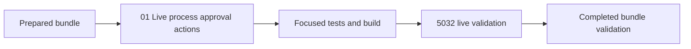

# Phase Plan

## Phase Sequence

1. Prepare and validate this focused bundle.
2. Implement `01-live-process-approval-actions`.
3. Run focused tests/build checks.
4. Validate the repaired behavior against the running 5032 app or record the blocker.
5. Complete the bundle execution report and final validator.

## Subbundle Dependency Map

## Critical Subbundles

- SB01 `01-01-live-process-approval-actions` owns the full fix. Weak proof here invalidates closure because no downstream implementation phase exists.

## Phase Gates

- Gate after preparation: run the bundle validator and repair failures.
- Gate before implementation: confirm the observed escalation is not a true approval and source files still match the inspected behavior.
- Gate after implementation: capture test/build proof and live 5032 proof or a concrete environment blocker.
- Gate before closure: rerun completed bundle validation and close N001 only with proof.
