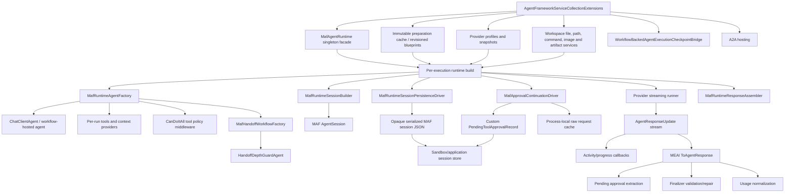

# Current Integration Map

## Key Boundary Rules

- The singleton runtime is a facade, not a mutable agent/session singleton.
- Preparation cache stores immutable definitions and snapshots.
- Runtime builds own mutable agents, sessions, tools, context, provider state, and disposables.
- Custom workspace services are the canonical file/tool boundary.
- The application transcript and compatibility record are separate from opaque MAF session state.
- Workflow activity and authoritative final output are currently projected from the same stream, which is the main 1.15 design pressure.
