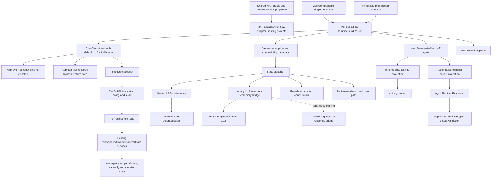

# Target Migration Architecture



## Target Decisions

### Package alignment

Use two shared properties, not five repeated literals:

```text
MicrosoftAgentsAIStableVersion = 1.15.0
MicrosoftAgentsAIPreviewVersion = 1.15.0-preview.260722.1
```

### Approval security

- binding remains enabled;
- old mixed-call behavior is preserved during parity through an explicit disable flag;
- pending approvals become request-addressed;
- legacy state is classified and cannot execute silently;
- MAF binding and CanDoItAll policy form defense-in-depth.

### Workflow output

- intermediate events remain available for user activity;
- one terminal projection is authoritative for machine output;
- response projection is not reconstructed by timestamp sorting;
- max handoff depth is enforced without forcing the wrong merge strategy.

### File tools

- no architectural replacement;
- no accidental Harness file provider;
- full regression and duplicate-tool inventory.

### State and rollback

- application compatibility metadata versions opaque MAF state;
- no in-place mutation of framework JSON;
- canary writes are measurable;
- rollback has a tested state-store strategy.
