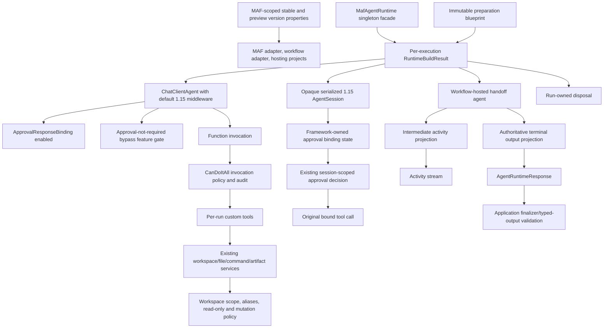

# Target Migration Architecture



## Target Decisions

### Package alignment

Use two MAF-owned properties, not five repeated literals. They live in
`src/MAF/MicrosoftAgentFramework.Packages.props` and are imported only by the three
package-owning projects:

```text
MicrosoftAgentsAIStableVersion = 1.15.0
MicrosoftAgentsAIPreviewVersion = 1.15.0-preview.260722.1
```

### Approval security

- binding remains enabled;
- old mixed-call behavior is preserved during parity through an explicit disable flag;
- the existing atomic decision applies only to the current server-held pending snapshot;
- stable request and call IDs are mandatory and never synthesized;
- a 1.13 approval without native 1.15 binding state is drained or reissued, never
  reconstructed from private JSON;
- MAF binding and CanDoItAll policy form defense-in-depth.

### Workflow output

- intermediate events remain available for user activity;
- one terminal projection is authoritative for machine output;
- response projection is not reconstructed by timestamp sorting;
- max handoff depth is enforced without forcing the wrong merge strategy.

### File tools

- no architectural replacement;
- no accidental Harness file provider;
- full regression and duplicate-tool inventory.

### State and rollback

- no in-place mutation of framework JSON;
- serialized native state remains opaque and is scrubbed only for request-scoped
  `DataContent`;
- rollback restores the quiesced pre-upgrade state snapshot; it does not deserialize
  1.15 approval state under 1.13;
- canary writes are measurable;
- rollback has a tested state-store strategy.
