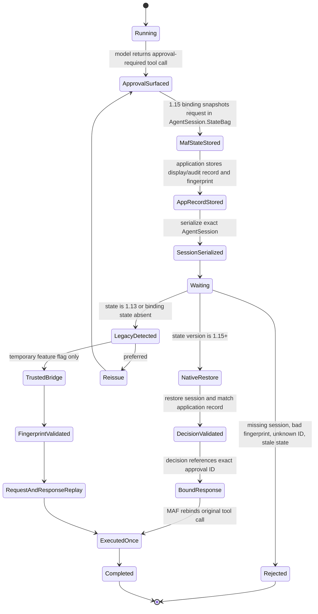

# Approval State Lifecycle

## Invariants

- A user decision never carries authoritative tool name or arguments.
- The server-held model-originated request is the authority.
- One approval ID maps to one exact tool call and one session/run.
- A decision is consumed once.
- Unknown, duplicate, stale, cross-session, or modified approvals do not execute.
- Process-local cache loss cannot remove the persistent security boundary.
- The compatibility bridge cannot accept arbitrary client-supplied request objects.
- Session scrubbing cannot remove approval binding state.
