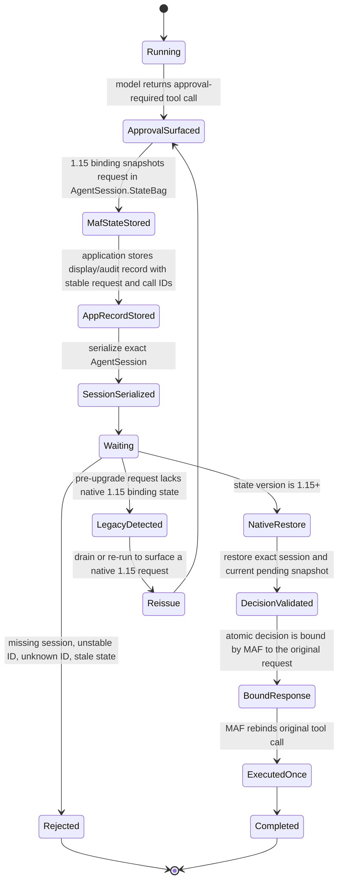

# Approval State Lifecycle

## Invariants

- A user decision never carries authoritative tool name or arguments.
- The server-held model-originated request is the authority.
- Every pending record retains the stable MAF request ID and call ID.
- A decision applies atomically to the current server-held pending snapshot and is
  consumed once by the restored MAF binding state.
- Unknown, duplicate, stale, cross-session, or modified approvals do not execute.
- Process-local cache loss cannot remove the persistent security boundary.
- No compatibility bridge reconstructs a request from client data or private framework
  JSON.
- Session scrubbing cannot remove approval binding state.
