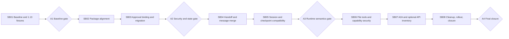

# Phase Plan



## Phase 0 — Freeze and Characterize 1.13

Owned by SB01.

Goals:

- verify branch head and clean working tree;
- run full discovery;
- capture package graph and warnings;
- capture current test/build status;
- create sanitized 1.13 serialized-state fixtures;
- capture handoff streaming/non-streaming response fixtures;
- record current file-tool composition and policies;
- establish rollback snapshot.

No package file may change before A1 passes.

## Phase 1 — Minimal Package and Compile Migration

Owned by SB02.

Goals:

- add shared stable/preview MAF version properties;
- update direct package references;
- preserve old mixed-tool approval surface with explicit 1.15 option;
- restore/build targeted projects;
- resolve compile breaks without adopting optional features;
- inventory warnings and API changes.

No session/approval workaround removal in this phase.

## Phase 2 — Approval Security and State Migration

Owned by SB03.

Goals:

- prove default approval binding is active on every provider path;
- add request-specific approval decisions;
- remove random approval ID fallback;
- version compatibility state;
- implement preferred legacy reissue path;
- implement a temporary bridge only if required;
- prove exact-once and attack resistance;
- prove scrubbed session persistence retains binding state.

A2 is a hard security gate.

## Phase 3 — Workflow/Handoff Output Correctness

Owned by SB04.

Goals:

- characterize direct and full runtime response projections;
- preserve intermediate activity;
- make terminal output authoritative;
- preserve max handoff depth;
- validate tool/result and reasoning/text ordering;
- remove only proven duplicate merge workarounds.

## Phase 4 — Session and Checkpoint Compatibility

Owned by SB05.

Goals:

- test 1.13 → 1.15 chat sessions;
- test provider-managed conversation IDs;
- test governed process isolation;
- test native workflow checkpoints/external requests if used;
- improve persistence diagnostics;
- prove cancellation/timeout behavior;
- test rollback fixture direction.

A3 requires both SB04 and SB05.

## Phase 5 — File and Capability Security Regression

Owned by SB06.

Goals:

- prove custom tools are unchanged;
- resolve every Harness/FileAccess discovery match;
- validate path and external-target security;
- validate approval wrappers and provider capability filters;
- validate concurrency and run isolation.

## Phase 6 — A2A and Optional API Inventory

Owned by SB07.

Goals:

- update and smoke-test A2A preview packages;
- inventory AG-UI, declarative, Harness, compaction, FileMemory, ToolApprovalAgent, message injection, CodeAct, Cosmos, and Responses hosting;
- make explicit defer/adopt-later decisions;
- perform warning suppression audit.

## Phase 7 — Cleanup, Canary, Rollback, Closure

Owned by SB08.

Goals:

- remove only workarounds proven obsolete;
- run complete tests and real provider validation;
- rehearse state migration and rollback;
- enable optional approval-not-required bypass only if its separate gate passes;
- update documentation and execution report;
- record remaining debt.

## Commit Strategy

Use one intentional commit per subbundle or smaller cohesive commits within a subbundle:

```text
test(maf): capture 1.13 compatibility fixtures
build(maf): align 1.15 stable and A2A preview packages
fix(maf): bind approval continuation to persisted requests
fix(maf): preserve terminal handoff output in streaming runtime
fix(maf): harden session compatibility diagnostics
test(filetools): prove workspace tool security after MAF upgrade
test(a2a): validate 1.15 preview hosting
refactor(maf): remove superseded compatibility workarounds
```

Do not mix optional feature adoption into the package-alignment commit.
