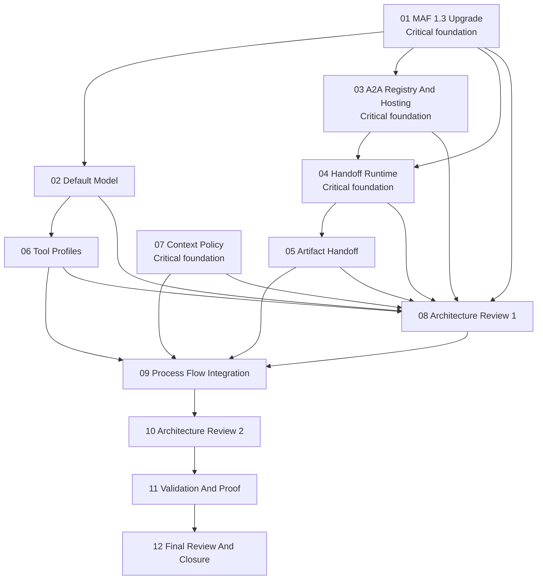

# Phase Plan

## Phase Sequence

1. `01-maf-1-3-upgrade-contract`: update stable MAF package references and resolve compile/API changes.
2. `02-default-model-and-provider-seeds`: migrate OpenAI defaults to `gpt-5.4-mini`.
3. `03-a2a-agent-registry-and-hosting`: add typed A2A configuration, remote agent resolution, and optional hosted endpoints.
4. `04-handoff-workflow-runtime`: build local/remote handoff workflow runtime support.
5. `05-process-artifact-handoff-enforcement`: harden process artifact handoff and QA evidence gates.
6. `06-tool-availability-profiles`: align dev/QA/business agent tool grants with role needs.
7. `07-context-session-and-compaction-policy`: audit and repair context/session limits.
8. `08-architecture-review-gate-1`: review package/model/runtime architecture and add remediation work if needed.
9. `09-process-flow-integration`: wire cooperation features into process launch/dispatch/runtime.
10. `10-architecture-review-gate-2`: review process integration and repair direction before validation.
11. `11-validation-and-operator-proof`: run targeted and broader validation.
12. `12-final-architecture-review-and-closure`: close traceability, risks, and final proof.

## Subbundle Dependency Map

## Critical Subbundles

- `01-maf-1-3-upgrade-contract`: Critical foundation. No A2A/handoff implementation should start until the core runtime builds against MAF 1.3.
- `03-a2a-agent-registry-and-hosting`: Critical foundation. A2A preview dependencies and endpoint security must be isolated before process integration.
- `04-handoff-workflow-runtime`: Critical foundation. Process flow cooperation depends on a real MAF handoff workflow, not prompt text.
- `07-context-session-and-compaction-policy`: Critical foundation. Long process runs are not trustworthy if context/session policy drops upstream artifacts or tool evidence.

## Phase Gates

- Preparation gate: run `python C:\Users\lucys\.codex\skills\candoitall-bundle-preparation\scripts\validate_bundle.py --profile initiative --stage prepared C:\repositories\CanDoItAll\codex\bundles\maf-1-3-a2a-handoffs`.
- Gate after subbundle 01: targeted AgentFramework Core/Maf build must pass against MAF 1.3, or an API remediation subbundle must be added.
- Gate after subbundle 04: a unit/integration test must prove a configured handoff can transfer work between at least two agents and preserve usable response state.
- Gate after subbundle 07: architecture review gate 1 must approve package/model/runtime boundaries before process flow integration starts.
- Gate after subbundle 09: architecture review gate 2 must approve process/runtime direction before broad validation.
- Closure gate: update `reviews/01-execution-report.md`, close every raw note, run targeted tests, run broader build/test as feasible, and run completed bundle validation.
