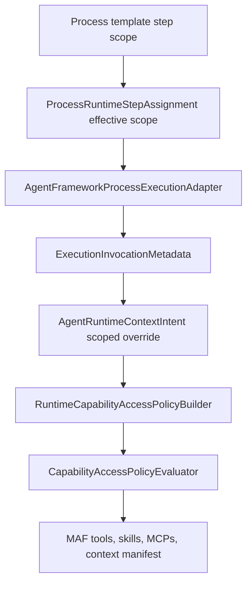

# Target Solution

## Architecture Shape

The target solution uses three layers instead of pushing domain text into common MAF:

1. Generic MAF runtime capability access and common workspace tools.
2. Process-neutral step scope contracts in the process layer.
3. AgentFramework process adapter mapping from process scope to MAF policies, metadata, and scoped prompt fragments.

## Runtime Flow

## Scope Contract Model

Process layer should define a process-neutral step scope contract, for example:

- `ProcessRuntimeCapabilityScope`
- `ProcessRuntimeCapabilityDirective`
- `ProcessRuntimeCapabilityDirectiveEffect`: `Deny`, `Require`, `AllowOnly`
- `ProcessRuntimeCapabilityTargetKind`: `Skill`, `Tool`, `RuntimeToolName`, `McpServer`, `McpTool`, `CapabilityTag`, `OperationClassification`, `RuntimeToolProvider`
- `ProcessScopedInstructionFragment`
- `ProcessScopedInstructionAttachmentMode`: `AlwaysWhenScopeValid`, `WhenRequiredCapabilityAvailable`, `WhenSelectorAllowed`

MAF layer should define or reuse runtime capability access DTOs that map to `CapabilityAccessRule`, `CapabilityIdentity`, and `CapabilitySelector`. The AgentFramework process adapter performs the translation.

## Allowlist Semantics

Existing `CapabilityAccessPolicyEvaluator` does not make `Allow` restrictive. Therefore:

- `Deny` suppresses capabilities.
- `Require` enforces forced tools/instruction carriers.
- `AllowOnly` must compile into explicit deny rules for non-matching candidates or a deliberate evaluator extension with default-deny semantics.

Do not expose authoring UI or template fields named `allowedCapabilities` if they only create non-restrictive `Allow` rules.

## Domain-Specific Image Analysis

Common workspace image analysis remains generic:

- It can state that only visible image evidence should be analyzed.
- It can include deterministic pixel evidence generated by the tool.
- It must not assume screenshots, UI state, browser proof, or software-delivery workflow.

Development-specific analysis moves to one of these owners:

- A dedicated development runtime tool/provider project.
- A development process template scoped instruction fragment.
- A domain-specific catalog skill that can be required or suppressed by process scope.

Common MAF must not reference the development owner.

## Failure Behavior

- Invalid process scope: governed execution blocks with a validation error.
- Required capability missing: governed execution blocks with `RequiredCapabilityDenied` diagnostics.
- Suppressed capability requested by prompt fragment: prompt fragment is not attached and diagnostics identify the mismatch.
- Unknown selector: validation error, not ignored.
- Provider key selector requested before provider identity is available: validation error or feature-disabled diagnostic, not best-effort matching.
