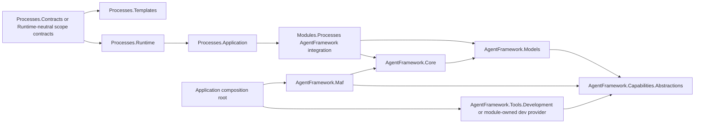

# C# Dependency Direction

## Current Scoped Graph

CodeAnalytics snapshot `snap-20260707120906-123d4de9` reported no cycles in the scoped graph.

Observed process direction:

- `Processes.Abstractions -> Processes.Contracts`
- `Processes.Core -> Processes.Abstractions, Processes.Contracts`
- `Processes.Builder -> Processes.Abstractions, Processes.Contracts, Processes.Core, Drivers.Abstractions`
- `Processes.Runtime -> Processes.Abstractions, Processes.Builder, Processes.Contracts, Processes.Core, Drivers.Abstractions`
- `Processes.Application -> Processes.Builder, Drivers.Abstractions, Processes.Runtime`
- `Processes.Drivers.Abstractions -> Processes.Abstractions, Processes.Contracts, Processes.Core`
- `Processes.Drivers.Standard -> Processes.Drivers.Abstractions`

## Target Direction

## Direction Rules

- Process contracts flow upward into integration, not downward into MAF.
- MAF does not depend on development tool implementations.
- Runtime tool-provider identity metadata flows from providers into MAF descriptors.
- Process authoring schema remains stable even if the AgentFramework adapter changes its internal mapping.

## Dependency Checks For Execution

- Run `dotnet build CanDoItAll.slnx`.
- Run a project reference scan after SB03 and SB05 to confirm no forbidden references were added.
- Rerun CodeAnalytics or equivalent dependency scan before closure and verify no cycles.
