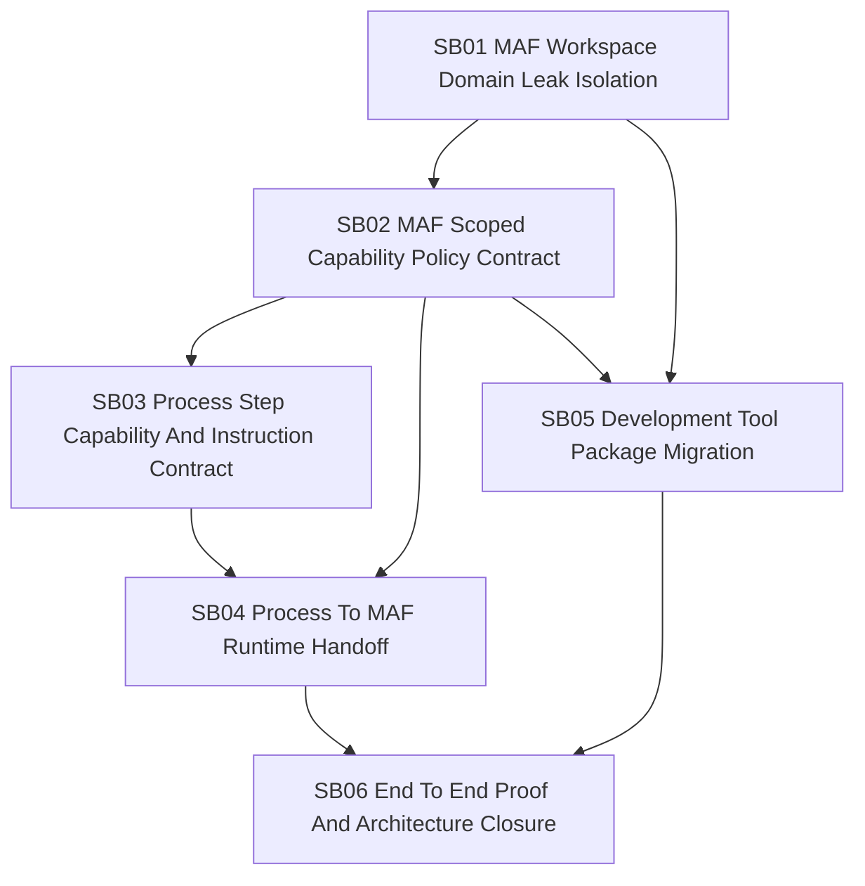

# Phase Plan

## Phase Sequence

1. SB01 isolates the immediate MAF workspace image prompt domain leak and proves the common tool is generic.
2. SB02 repairs MAF scoped capability policy support, including required capabilities and provider identity selectors.
3. SB03 adds process-neutral step scope and scoped instruction contracts to process templates, assignments, and persistence.
4. SB04 connects process scope to MAF execution metadata, runtime context intent, policy building, and prompt composition.
5. SB05 migrates development-specific image analysis behavior into a development-owned package or process-owned capability.
6. SB06 validates the full system with unit tests, integration tests, text scans, dependency scans, and architecture gate review.

## Subbundle Dependency Map

## Critical Subbundles

All subbundles are critical because a partial fix can either leave the common domain leak in place or create a policy mechanism that appears to restrict tools while failing open.

| Subbundle | Criticality | Required gate |
| --- | --- | --- |
| SB01 | Critical foundation | Common image analysis contains no development/UI terms and tests prove generic behavior. |
| SB02 | Critical enforcement foundation | MAF suppression and required-capability semantics are implemented through the existing evaluator with non-empty requirements. |
| SB03 | Critical process contract foundation | Process scope is strongly typed, persisted, validated, and runtime-neutral. |
| SB04 | Critical integration foundation | Process-to-MAF metadata handoff fails closed and drives both prompt fragments and capability access. |
| SB05 | Critical ownership foundation | Development screenshot analysis is available outside common MAF and common MAF has no dependency on it. |
| SB06 | Critical closure | End-to-end management-only suppression, required-capability failure, text scans, dependency scans, and tests pass. |

## Phase Gates

- Gate after preparation: run the prepared-stage bundle validator and repair failures.
- Gate before SB01: confirm no production implementation was started during preparation.
- Gate after SB01: do not add process schema until common MAF image analysis is generic.
- Gate after SB02: do not expose process authoring fields until MAF can enforce deny/require correctly.
- Gate after SB03: do not wire metadata until effective scope is persisted and validated.
- Gate after SB04: do not migrate development prompts until process scope and MAF enforcement agree on one contract.
- Gate after SB05: do not close until common MAF is rescanned for development/UI prompt terms.
- Gate before closure: rerun validators, targeted tests, dependency scans, source text scans, and architecture gate.

## Validation Matrix

| Area | Validation required |
| --- | --- |
| Domain neutrality | Unit tests and text scan for common MAF image prompts. |
| Suppression | Capability access tests for skill, tool, MCP server/tool, provider, tag, and operation selectors. |
| Required capability | Tests for missing, denied, and satisfied required capability paths. |
| Process contracts | Template parsing, validation, assignment persistence, projection, and repair tests. |
| Handoff | Metadata serialize/resolve tests and runtime context intent assertions. |
| Prompt composition | Scoped instruction fragments attached only when valid and capability-compatible. |
| End-to-end | Management-only step suppresses development skill without changing agent defaults. |
| Architecture | CodeAnalytics/dependency scan, forbidden reference scan, and C# architecture gate. |

## Semantic Adequacy Rules

- Each subbundle must create `proof/SBxx/manifest.md` and `proof/SBxx/semantic-invariants.md` during execution.
- Proof must use production code paths. Test-only wrappers and prompt-only assertions do not count.
- Any new runtime contract, diagnostic, persisted field, metadata key, or policy result must include a Production Behavior Artifact Matrix.
