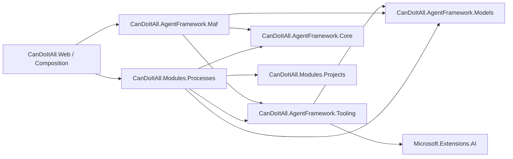

# Target Solution

## Target Dependency Direction



Forbidden after SB05:

```text
CanDoItAll.AgentFramework.Maf -> CanDoItAll.Modules.Processes
```

## New Abstraction Project

Preferred project:

```text
src/CanDoItAll.AgentFramework.Tooling/CanDoItAll.AgentFramework.Tooling.csproj
```

Responsibilities:

- Define runtime tool-provider contracts.
- Avoid process-specific DTOs.
- Avoid MAF-specific types beyond provider-neutral `Microsoft.Extensions.AI.AITool`.
- Avoid dependency on `CanDoItAll.Modules.*`.

Expected references:

```xml
<ProjectReference Include="..\CanDoItAll.AgentFramework.Models\CanDoItAll.AgentFramework.Models.csproj" />
<PackageReference Include="Microsoft.Extensions.AI.Abstractions" Version="<repo-compatible version>" />
```

If the repo resolves `AITool` only transitively through `Microsoft.Agents.AI`, Codex must inspect package restore and choose the minimal explicit package reference that builds cleanly.

## Core Contracts

Suggested initial types:

```csharp
public interface IAgentRuntimeToolProvider
{
    int Order { get; }

    ValueTask<IReadOnlyList<AITool>> CreateToolsAsync(
        AgentRuntimeToolProviderContext context,
        CancellationToken cancellationToken);
}

public sealed record AgentRuntimeToolProviderContext(
    AgentDefinition Agent,
    ProviderProfile Provider,
    IReadOnlyList<CapabilityCatalogItem> Capabilities,
    bool SuppressApprovalRequirements,
    AgentRuntimeToolProviderPurpose Purpose,
    string RuntimeSessionKey,
    IReadOnlyDictionary<string, string> Tags);

public enum AgentRuntimeToolProviderPurpose
{
    InteractiveChat = 0,
    GovernedProcessAutomation = 1,
    AutoApprovedNonInteractive = 2,
    A2AEndpoint = 3
}
```

Keep the contract deliberately small. This is not yet `IProcessDriverPack`.

## MAF Changes

Replace hard-coded process tool attachment with provider-based attachment:

```text
AttachRegisteredRuntimeToolProvidersAsync(...)
```

The MAF adapter should:

- resolve `IEnumerable<IAgentRuntimeToolProvider>` from `services`;
- call providers in deterministic `Order`;
- pass agent/provider/capabilities/suppressApprovalRequirements/purpose;
- wrap process mutation tools through the same central approval rule used today;
- deduplicate tool names after all providers run;
- trace provider attachment counts in progress callback;
- continue to work if zero providers are registered.

## Processes Changes

Move current `ProcessToolBuilder` into:

```text
src/CanDoItAll.Modules.Processes/AgentTools/ProcessAgentRuntimeToolProvider.cs
```

This provider owns:

- resolving/using `ProcessesService`;
- resolving/using template catalog/pack/projection/Mermaid services;
- constructing all current process tools;
- process access checks;
- process-specific request/result DTOs currently housed in `MafAgentRuntime.ProcessTools.cs`;
- process tool exception mapping.

Processes module registration:

```csharp
services.TryAddEnumerable(
    ServiceDescriptor.Scoped<IAgentRuntimeToolProvider, ProcessAgentRuntimeToolProvider>());
```

If MAF is singleton in any host path, provider invocation must happen inside a valid scope or must be safe for scoped providers. Codex must inspect existing `MafAgentRuntime` registrations before implementing.

## Compatibility Phase

SB03 may keep the old process tool builder temporarily. SB05 must remove it.

Final MAF source must not contain:

```text
CreateProcessToolBuilder
ProcessToolBuilder
AttachInternalProcessToolsAsync
using CanDoItAll.Modules.Processes
```
