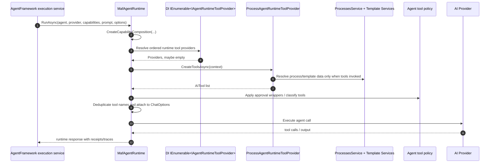

# Tool Provider Runtime Sequence

## Required Behavior

- Tool provider resolution must be deterministic.
- A provider failure during composition must fail predictably with provider name and diagnostic message.
- A provider returning duplicate names must not silently shadow a previously registered tool.
- The same approval wrapper semantics must apply to process tools after migration.
- Provider-based composition must not require process services when Processes module is absent.
