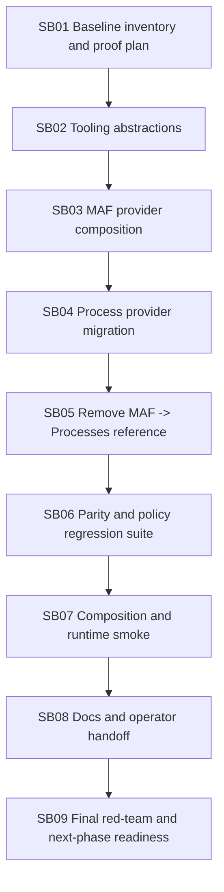

# Phase Plan

## Execution Order

| Subbundle | Title | Critical foundation | Prerequisite |
| --- | --- | --- | --- |
| SB01 | Baseline coupling inventory and proof plan | Yes | None |
| SB02 | Agent runtime tooling abstractions | Yes | SB01 |
| SB03 | MAF registered tool-provider composition | Yes | SB02 |
| SB04 | Process tool migration into Processes module | Yes | SB03 |
| SB05 | Remove MAF -> Processes project reference | Yes | SB04 |
| SB06 | Process tool parity and policy regression suite | Yes | SB05 |
| SB07 | Composition registration and runtime smoke | Yes | SB06 |
| SB08 | Documentation and operator handoff | No | SB07 |
| SB09 | Final red-team and next-phase readiness | Yes | SB08 |

## Subbundle Dependency Map

## Critical Subbundles

Critical foundations:

- SB01: downstream proof cannot be trusted without a complete inventory.
- SB02: all later work depends on the abstraction not importing product modules.
- SB03: MAF must support provider composition before moving process tools.
- SB04: exact process tool parity is the core migration.
- SB05: actual dependency removal is the main architectural gate.
- SB06: test repair and policy proof prevents silent simplification.
- SB07: runtime smoke proves composition is not just compile-time.
- SB09: final closure validates fake-proof resistance.

SB08 is non-critical but required for operator continuity.

## Phase Gates

| Gate | Must pass before |
| --- | --- |
| SB01 inventory complete and source assertions recorded | SB02 |
| Tooling project builds and has no product-module references | SB03 |
| MAF attaches fake provider and works with zero providers | SB04 |
| Process provider exposes all 23 process tools in tests | SB05 |
| MAF project/source has no Processes dependency | SB06 |
| Parity and policy tests pass | SB07 |
| Runtime composition smoke passes with and without Processes | SB08 |
| Documentation updated | SB09 |
| Red-team closure passes | Bundle complete |

## Reopen Rules

- If SB04 parity fails during SB06, reopen SB04.
- If dependency guard fails during SB07, reopen SB05.
- If runtime smoke shows missing process tools, reopen SB03/SB04 based on whether provider registration or provider implementation failed.
- If documentation claims a completed core split or driver pack, reopen SB08 because this bundle does not deliver those phases.
